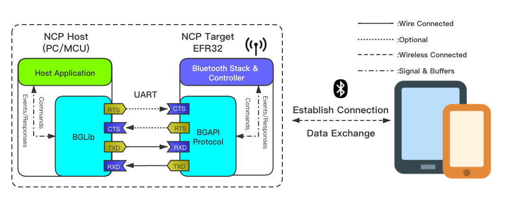

# NCP DFU

This is a Network  Co-Processor (NCP) target application with Device Firmware Update (DFU). It runs the Bluetooth stack and provides access to it by exposing the Bluetooth API (BGAPI) via UART connection. NCP mode makes it possible to run your application on a host controller or PC.

In addition to being an NCP example application, this application allows the user to reset the device in bootloader mode. The bootloader accepts special BGAPI commands that enable the host application to update the NCP firmware on the device. This feature can be tested with the *Bluetooth - Host UART DFU* example project.

 > Note: this example expects a specific Gecko Bootloader to be present on your device. For details, see the [Troubleshooting](#troubleshooting) section.

## Getting Started

To get started with Silicon Labs Bluetooth software and Simplicity Studio, see [QSG169: Bluetooth SDK v3.x Quick Start Guide](https://www.silabs.com/documents/public/quick-start-guides/qsg169-bluetooth-sdk-v3x-quick-start-guide.pdf).

In the NCP context, the application runs on a host MCU or PC, which is called the NCP Host, while the Bluetooth stack runs on an EFR32, which is called the NCP Target.

The NCP Host and Target communicate via a serial interface (UART), which can be tunneled either via USB or via Ethernet if you use a development kit. The communication between the NCP Host and Target is defined in the Silicon Labs proprietary protocol called BGAPI. BGLib is the C reference implementation of the BGAPI protocol, which is to be used on the NCP Host side.

[AN1259: Using the v3.x Silicon Labs Bluetooth Stack in Network Co-Processor Mode](https://www.silabs.com/documents/public/application-notes/an1259-bt-ncp-mode-sdk-v3x.pdf) provides a detailed description how NCP works and how to configure it for your custom hardware.

The following figures show the system view of NCP mode.

## Device Firmware Update

To run the DFU, you need this NCP target application and the *Bluetooth - Host UART DFU* NCP host application. Follow the steps below.

1. Build the example solution and flash the combined bootloader + application binary to your device. See the [Troubleshooting](#troubleshooting) section.
1. Modify the code so you can differentiate between the old and new firmware (e.g., add a custom NCP command or modify an existing one in `ncp_user_cmd.c`).
1. Optionally, you can modify the *create_gbl* step in the *Post-Build Editor (PBE)*. You can learn more about generating GBL files using the *Post-Build Editor* in [Simplicity Studio 5 Users Guide: Post-Build Editor (PBE)](https://docs.silabs.com/simplicity-studio-5-users-guide/latest/ss-5-users-guide-building-and-flashing/post-build-editor).
1. Build the project again, but do not flash.
1. Observe that a GBL (Gecko Bootloader) file is generated automatically along with the build artifacts. The filename will be similar to *bt_ncp_dfu.gbl* but may vary based on the project variant.
1. Build the *Bluetooth - Host UART DFU* project for your host environment (Windows, Linux, or macOS).
1. Flash the GBL file to the NCP target device using the NCP host application. See the README of the host application for usage details.
1. Verify that the new firmware is running by checking the code modification.

## Troubleshooting

### Bootloader Issues

This example solution includes 2 projects: the application example and a compatible bootloader.
When flashing this solution to the device, make sure to select the combined binary from the `artifact` folder.
This combined binary is named after the example solution, e.g. `bt_ncp_dfu_btl.s37`.

Flashing only the application binary (e.g., `bt_ncp_dfu.s37`) will work only if a compatible bootloader is already present on the device.

### Programming the Radio Board

Before programming the radio board mounted on the mainboard, make sure the power supply switch is in the AEM position (right side) as shown below.

## Resources

[Bluetooth Documentation](https://docs.silabs.com/bluetooth/latest/)

[UG103.14: Bluetooth LE Fundamentals](https://www.silabs.com/documents/public/user-guides/ug103-14-fundamentals-ble.pdf)

[QSG169: Bluetooth SDK v3.x Quick-Start Guide](https://www.silabs.com/documents/public/quick-start-guides/qsg169-bluetooth-sdk-v3x-quick-start-guide.pdf)

[AN1259: Using the v3.x Silicon Labs Bluetooth Stack in Network Co-Processor Mode](https://www.silabs.com/documents/public/application-notes/an1259-bt-ncp-mode-sdk-v3x.pdf)

[AN1086: Using the Gecko Bootloader with the Silicon Labs Bluetooth® Applications](https://www.silabs.com/documents/public/application-notes/an1086-gecko-bootloader-bluetooth.pdf)

[Bluetooth Training](https://www.silabs.com/support/training/bluetooth)

## Report Bugs & Get Support

You are always encouraged and welcome to report any issues you found to us via [Silicon Labs Community](https://www.silabs.com/community).