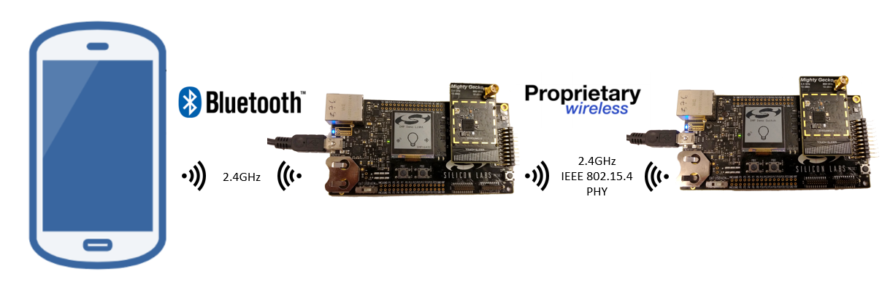
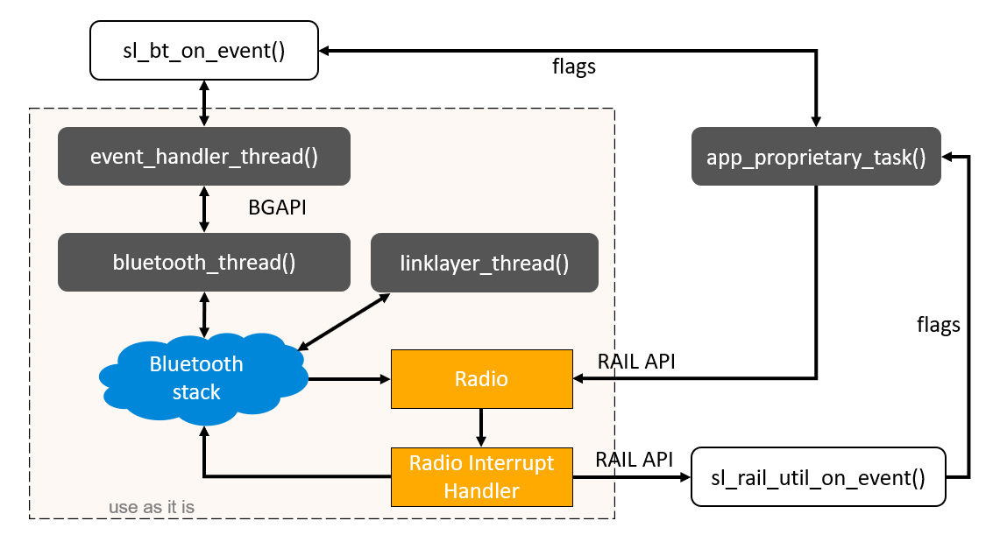
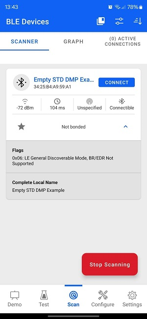

# SoC - Empty Standard DMP

This example application contains a basic implementation of a Bluetooth and proprietary dynamic multiprotocol (DMP) application. It serves as a starting point for any DMP application development.

Note: This DMP application uses a standard physical layer for the proprietary protocol, defined by the  IEEE 802.15.4 standard, which cannot be changed.

> Note: this example does not include Device Firmware Update (DFU) functionality by default. For details see the [Device Firmware Update](#device-firmware-update) section.

## Getting Started

To get started with Silicon Labs Bluetooth and Simplicity Studio, see [QSG169: Bluetooth SDK v3.x Quick Start Guide](https://www.silabs.com/documents/public/quick-start-guides/qsg169-bluetooth-sdk-v3x-quick-start-guide.pdf).

This example implements a basic project with Bluetooth Low Energy and a proprietary protocol running parallel on the device. The project is based on a Real Time Operating System (Micrium OS or FreeRTOS according to your choice). For more information about using Real Time Operating Systems with Bluetooth, see [AN1260: Integrating v3.x Silicon Labs Bluetooth Applications with Real-Time Operating Systems](https://www.silabs.com/documents/public/application-notes/an1260-integrating-v3x-bluetooth-applications-with-rtos.pdf).

For more details about the Bluetooth and proprietary DMP applications, see [AN1269: Dynamic Multiprotocol Development with Bluetooth and Proprietary Protocols on RAIL in GSDK v3.x](https://www.silabs.com/documents/public/application-notes/an1269-bluetooth-rail-dynamic-multiprotocol-gsdk-v3x.pdf) and [UG305: Dynamic Multiprotocol User’s Guide](https://www.silabs.com/documents/public/user-guides/ug305-dynamic-multiprotocol-users-guide.pdf).

## Project Setup

The principle is the same for all Bluetooth DMP (Dynamic Multi-Protocol) applications: the device is able to communicate via Bluetooth and via a secondary protocol (either a standard one, like Zigbee, or a proprietary one) at the same time, making it possible to control the DMP device with different type of devices, or the DMP device can also act as a gateway between the different protocols. The physical layer of the proprietary protocol may be a standard one (like IEEE 802.15.4) or entirely proprietary if your device provides support for it (see datasheet).

This project implements the skeleton of such a solution using Bluetooth and a proprietary protocol with a standard physical layer. Callbacks for Bluetooth and proprietary event handling are added, but not implemented (except a very basic Bluetooth functionality that starts advertising after the boot event). The developer can add any functionality.

## Project Structure

The following image shows the overview of the software Architecture of the project.

The Bluetooth stack and RAIL are running in the background, using several tasks that should not be modified by the developer. Instead, `sl_bt_on_event()` and `sl_rail_util_on_event()` should be populated with Bluetooth and proprietary event handlers. Note: `sl_rail_util_on_event()` is called from interrupt context, therefore it must implement time-critical event handlers only! Non-time-critical event handling must be implemented in the `app_proprietary_task()`. `sl_bt_on_event()` is not called from interrupt context, therefore it can implement any type of event handlers. To add additional non-event-driven functionality, create new custom tasks.

### Bluetooth Configuration

The Bluetooth stack can be configured via the Bluetooth Software Components (see the SOFTWARE COMPONENTS tab in the Project Configurator for the .slcp file).

The project also contains a basic GATT database. GATT definitions can be extended using the GATT Configurator, which can be found under Advanced Configurators in the Software Components tab of the Project Configurator.

To learn how to use the GATT Configurator, see [UG438: GATT Configurator User’s Guide for Bluetooth SDK v3.x](https://www.silabs.com/documents/public/user-guides/ug438-gatt-configurator-users-guide-sdk-v3x.pdf).

The Bluetooth task creation and the stack initialization is already implemented in the `sl_stack_init` function, called from the `main` function. The Bluetooth event handler function, `sl_bt_on_event`, can be found in the file *bluetooth_app.c*. This contains a basic event handler, which can be extended according to the applications needs. The default implementation starts advertising with the device name defined in the GATT Configurator. After flashing it to the device, it will be visible in the Simplicity Connect app, as follows:

### Proprietary Configuration

RAIL (Radio Abstraction and Integration Layer) can be configured via the RAIL Software Components.

This DMP application uses a standard physical layer for the proprietary protocol, defined by the  IEEE 802.15.4 standard, which cannot be changed. As a consequence, Radio Configurator cannot be used in this project.

`sl_rail_util_on_event()` and `app_proprietary_task()` are implemented in *app_proprietary.c*. Extend these functions to implement your proprietary event handlers.

### Application Tasks

You can implement additional application-specific tasks in *app.c*. You can create and handle any RTOS task here according to your functionality.

## Device Firmware Update

This example project does not include Device Firmware Update (DFU) functionality by default, but it can be added easily.
SoC applications can use one of Silicon Labs' Over-the-Air (OTA) DFU implementations. The table below summarizes the options:

|                           | In-place OTA DFU                 | Application OTA DFU                 |
|---------------------------|----------------------------------|-------------------------------------|
| **Component to add**      | In-place OTA DFU                 | Application OTA DFU                 |
| **Compatible bootloader** | Bluetooth Apploader OTA DFU      | Bootloader - SoC Internal Storage (Series 2)   Bootloader - SoC Storage (Series 3) |
| **Reference solution**    | Bluetooth - SoC In-Place OTA DFU | Bluetooth - SoC Application OTA DFU |
| **Supported devices**     | Supports Series 2 devices only and requires a smaller flash size | Supports Series 2 and Series 3 devices with enough flash to store firmware images in 2 instances |

To add DFU to an existing project:
- Add the appropriate DFU component to your project using Simplicity Studio’s Software Component browser.
- Add a post-build step to generate the GBL (Gecko Bootloader) file using Simplicity Studio’s Post Build Editor.
- Rebuild the project.
- Flash a compatible bootloader to the device.

For more information on bootloaders, see [UG103.6: Bootloader Fundamentals](https://www.silabs.com/documents/public/user-guides/ug103-06-fundamentals-bootloading.pdf) and [UG489: Silicon Labs Gecko Bootloader User's Guide for GSDK 4.0 and Higher](https://www.silabs.com/documents/public/user-guides/ug489-gecko-bootloader-user-guide-gsdk-4.pdf).

## Troubleshooting

### Programming the Radio Board

Before programming the radio board mounted on the mainboard, make sure the power supply switch is in the AEM position (right side) as shown below.

## Resources

[Bluetooth Documentation](https://docs.silabs.com/bluetooth/latest/)

[UG103.14: Bluetooth LE Fundamentals](https://www.silabs.com/documents/public/user-guides/ug103-14-fundamentals-ble.pdf)

[QSG169: Bluetooth SDK v3.x Quick Start Guide](https://www.silabs.com/documents/public/quick-start-guides/qsg169-bluetooth-sdk-v3x-quick-start-guide.pdf)

[UG434: Silicon Labs Bluetooth ® C Application Developer's Guide for SDK v3.x](https://www.silabs.com/documents/public/user-guides/ug434-bluetooth-c-soc-dev-guide-sdk-v3x.pdf)

[AN1260: Integrating v3.x Silicon Labs Bluetooth Applications with Real-Time Operating Systems](https://www.silabs.com/documents/public/application-notes/an1260-integrating-v3x-bluetooth-applications-with-rtos.pdf)

[AN1269: Dynamic Multiprotocol Development with Bluetooth and Proprietary Protocols on RAIL in GSDK v3.x](https://www.silabs.com/documents/public/application-notes/an1269-bluetooth-rail-dynamic-multiprotocol-gsdk-v3x.pdf)

 [UG305: Dynamic Multiprotocol User’s Guide](https://www.silabs.com/documents/public/user-guides/ug305-dynamic-multiprotocol-users-guide.pdf)

[Bluetooth Training](https://www.silabs.com/support/training/bluetooth)

## Report Bugs & Get Support

You are always encouraged and welcome to report any issues you found to us via [Silicon Labs Community](https://www.silabs.com/community).
