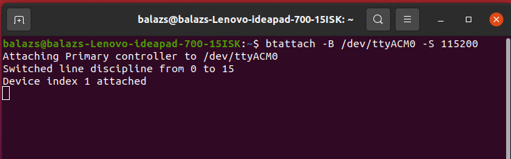
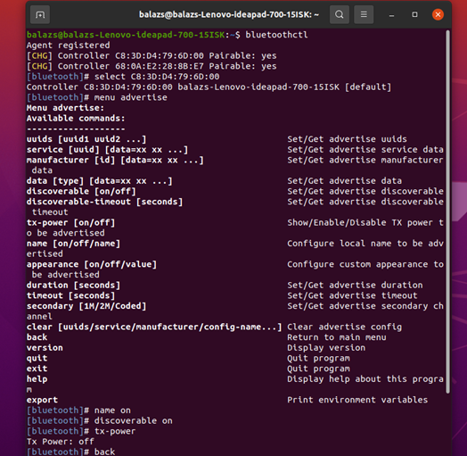
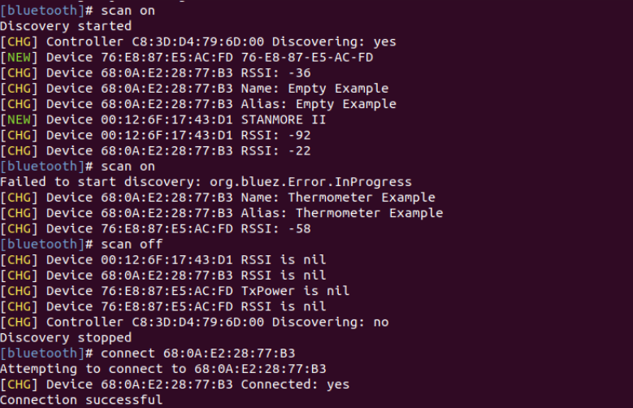

# RCP

The RCP (Radio Co-Processor) example application runs the Bluetooth Controller (radio + Link Layer) and implements the controller part of the HCI, as defined in the *Bluetooth Core Specification, Vol 4: Host Controller Interface*. The HCI is a standardized way for Bluetooth host and controller to communicate with each other. Because the interface is standard, the host and controller can be from different vendors. Currently, Silicon Labs Bluetooth Controller supports UART (Universal Asynchronous Receiver-Transmitter) as the HCI transport layer.

> Note: This example does not include Device Firmware Update (DFU) functionality by default. For details see the [Device Firmware Update](#device-firmware-update) section.

## Getting Started

To get started with Silicon Labs Bluetooth and Simplicity Studio, see [QSG169: Bluetooth SDK v3.x Quick Start Guide](https://www.silabs.com/documents/public/quick-start-guides/qsg169-bluetooth-sdk-v3x-quick-start-guide.pdf).

## HCI Protocol

The HCI layer provides set of commands and events and ACL data packets. The Host sends commands to the controller. The commands are used to start advertising or scanning, establish a connection to another Bluetooth device, read status information from the controller, and so on.

Events are sent from the Controller side to the Host. Events are used as a response to commands or to indicate various events in the controller such as scanning reports, establishing or closing a connection, and various failures.

Silicon Labs Bluetooth LE Controller runs on EFR32 Radio Co-Processors. External Bluetooth Host stacks communicates with the controller over the HCI, also called RCP mode, as shown in the following figure.

For more details, see [AN1328: Enabling a Radio Co-Processor using the Bluetooth HCI Function](https://www.silabs.com/documents/public/application-notes/an1328-enabling-rcp-using-bt-hci.pdf)

## Supported Modes

ACL (Asynchronous Connection Less) data packets deliver user application data between the host and the controller in both directions.

The Silicon Labs Bluetooth LE Controller does not support SCO (Synchronous Connection Oriented) and ISOC (Isochronous Channels) modes. Also, the related HCI messages are not supported.

The Bluetooth specification defines Low Energy (LE), BR/EDR (classic), and AMP (alternate MAC and PHY) controllers. Note that Silicon Labs only supports the LE controller.

## Communication Interface

The application uses UART as the HCI Transport layer. By default, UART is configured as follows:
  - Hardware flow control: disabled
  - Speed: 115200 kbps
  - Data bits: 8
  - Parity bit: N
  - Stop bits: 1

The default configuration can be changed with the **vcom** component. For more details about the customization of the project, see [AN1328: Enabling a Radio Co-Processor using the Bluetooth HCI Function](https://www.silabs.com/documents/public/application-notes/an1328-enabling-rcp-using-bt-hci.pdf).

## Usage

Because HCI is a standardized interface, it can be used with any Host that implements the HCI via UART. For example, it can be used with the BlueZ stack included in Linux systems. Connect your device flashed with the RCP firmware to your system. Then, attach it as a HCI device with the command *btattach*:

Now, it can be controlled with any tool that uses HCI commands, e.g., *bluetoothctl* :

## Device Firmware Update

This example project does not include Device Firmware Update (DFU) functionality by default.
To add DFU to an existing project:
- Add the `Bootloader Interface` component to your project using Simplicity Studio’s Software Component browser.
- Add a post-build step to generate the GBL (Gecko Bootloader) file using Simplicity Studio’s Post Build Editor.
- Rebuild the project.
- Flash the `Bootloader - NCP BGAPI UART DFU` bootloader to the device.

See the `Bluetooth - NCP DFU` example solution for reference.

For more information on bootloaders, see [UG103.6: Bootloader Fundamentals](https://www.silabs.com/documents/public/user-guides/ug103-06-fundamentals-bootloading.pdf) and [UG489: Silicon Labs Gecko Bootloader User's Guide for GSDK 4.0 and Higher](https://www.silabs.com/documents/public/user-guides/ug489-gecko-bootloader-user-guide-gsdk-4.pdf).

## Troubleshooting

### Programming the Radio Board

Before programming the radio board mounted on the mainboard, make sure the power supply switch is in the AEM position (right side) as shown below.

## Resources

[Bluetooth Documentation](https://docs.silabs.com/bluetooth/latest/)

[UG103.14: Bluetooth LE Fundamentals](https://www.silabs.com/documents/public/user-guides/ug103-14-fundamentals-ble.pdf)

[QSG169: Bluetooth SDK v3.x Quick Start Guide](https://www.silabs.com/documents/public/quick-start-guides/qsg169-bluetooth-sdk-v3x-quick-start-guide.pdf)

[UG434: Silicon Labs Bluetooth ® C Application Developer's Guide for SDK v3.x](https://www.silabs.com/documents/public/user-guides/ug434-bluetooth-c-soc-dev-guide-sdk-v3x.pdf)

[Bluetooth Training](https://www.silabs.com/support/training/bluetooth)

## Report Bugs & Get Support

You are always encouraged and welcome to report any issues you found via [Silicon Labs Community](https://www.silabs.com/community).