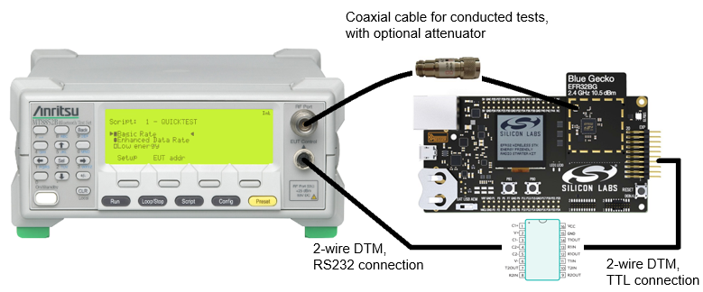

# SoC - DTM

This example application provides the Direct Test Mode (DTM) through a 2-wire UART interface for the RF PHY testing of a Bluetooth Low Energy device.

> Note: This example does not include Device Firmware Update (DFU) functionality by default. For details see the [Device Firmware Update](#device-firmware-update) section.

## Direct Test Mode (DTM) Overview

DTM is typically used with a separate Bluetooth Tester device.

DTM can be used either through a 2-wire UART interface, as described in this example, or over HCI, which is currently not supported. The 2-wire UART interface uses baud rates from 1200 up to 115200 bps (the default) always with 8 data bits, no parity, 1 stop bit and without flow control (no RTS nor CTS).

> Note: The DTM example uses UART VCOM (USB). When using a mainboard with a Radio Board, the EXP-header UART also can be used because of the same pin layout. Since flow control is not in use, only the TX and RX UART pins are needed. For more information, please refer to the configuration of the iostream component.

DTM can be also used without a separate Bluetooth Tester device when testing more manually with a spectrum analyzer and signal generator setup by sending the command bytes with a special terminal. To use this setup more easily, consider using the [BGTool](https://www.silabs.com/documents/public/application-notes/an1267-bt-rf-phy-evaluation-using-dtm-sdk-v3x.pdf) desktop application instead, which uses the [NCP-mode](https://www.silabs.com/documents/public/application-notes/an1259-bt-ncp-mode-sdk-v3x.pdf) [BGAPI](https://docs.silabs.com/bluetooth/latest)-interface.

Although the DTM is defined for the Bluetooth Qualifications, it can be used to run most of the Regulatory Certification tests.

Typical use cases for the DTM:
- SoCs:
  - Regulatory Certifications testing
  - RF-PHY testing for the Bluetooth Qualification if the design does not match the reference design
  - Production testing
- Modules:
  - Regulatory Certifications testing (required for the modules in Europe)
  - Spot checks (strongly recommended by FCC)
  - RF-PHY testing for the Bluetooth Qualification if the design might affect the module operation
  - Production testing
- Radio Boards with WSTK:
  - Mostly for getting to know the DTM overall and testing the setup
  - Typically not much practical usage

For more information about using the DTM, see the following:

- [AN1267: Radio Frequency Physical Layer Evaluation in Bluetooth SDK v3.x](https://www.silabs.com/documents/public/application-notes/an1267-bt-rf-phy-evaluation-using-dtm-sdk-v3x.pdf)

The full DTM specification can be found here:

- [Bluetooth Core Specification Adopted Version 5.2, Vol 6: Low Energy Controller, Part F: Direct Test Mode](https://www.bluetooth.com/specifications/bluetooth-core-specification/)

## Getting Started

To get started with Silicon Labs Bluetooth and Simplicity Studio, see [QSG169: Bluetooth SDK v3.x Quick Start Guide](https://www.silabs.com/documents/public/quick-start-guides/qsg169-bluetooth-sdk-v3x-quick-start-guide.pdf).

The instructions to create and flash the DTM example application are in the [AN1267: Radio Frequency Physical Layer Evaluation in Bluetooth SDK v3.x](https://www.silabs.com/documents/public/application-notes/an1267-bt-rf-phy-evaluation-using-dtm-sdk-v3x.pdf). The same document contains information about customizing UART pins for your own hardware, and examples illustrating using the DTM.

Detailed specifications are in the Bluetooth Specifications.

## Device Firmware Update

This example project does not include Device Firmware Update (DFU) functionality by default, but it can be added easily.
SoC applications can use one of Silicon Labs' Over-the-Air (OTA) DFU implementations. The table below summarizes the options:

|                           | In-place OTA DFU                 | Application OTA DFU                 |
|---------------------------|----------------------------------|-------------------------------------|
| **Component to add**      | In-place OTA DFU                 | Application OTA DFU                 |
| **Compatible bootloader** | Bluetooth Apploader OTA DFU      | Bootloader - SoC Internal Storage (Series 2)   Bootloader - SoC Storage (Series 3) |
| **Reference solution**    | Bluetooth - SoC In-Place OTA DFU | Bluetooth - SoC Application OTA DFU |
| **Supported devices**     | Supports Series 2 devices only and requires a smaller flash size | Supports Series 2 and Series 3 devices with enough flash to store firmware images in 2 instances |

To add DFU to an existing project:
- Add the appropriate DFU component to your project using Simplicity Studio’s Software Component browser.
- Add a post-build step to generate the GBL (Gecko Bootloader) file using Simplicity Studio’s Post Build Editor.
- Rebuild the project.
- Flash a compatible bootloader to the device.

For more information on bootloaders, see [UG103.6: Bootloader Fundamentals](https://www.silabs.com/documents/public/user-guides/ug103-06-fundamentals-bootloading.pdf) and [UG489: Silicon Labs Gecko Bootloader User's Guide for GSDK 4.0 and Higher](https://www.silabs.com/documents/public/user-guides/ug489-gecko-bootloader-user-guide-gsdk-4.pdf).

## Troubleshooting

### Programming the Radio Board

Before programming the radio board mounted on the mainboard, make sure the power supply switch is in the AEM position (right side) as shown below.

## Resources

[Bluetooth Documentation](https://docs.silabs.com/bluetooth/latest/)

[UG103.14: Bluetooth LE Fundamentals](https://www.silabs.com/documents/public/user-guides/ug103-14-fundamentals-ble.pdf)

[QSG169: Bluetooth SDK v3.x Quick Start Guide](https://www.silabs.com/documents/public/quick-start-guides/qsg169-bluetooth-sdk-v3x-quick-start-guide.pdf)

[UG434: Silicon Labs Bluetooth ® C Application Developer's Guide for SDK v3.x](https://www.silabs.com/documents/public/user-guides/ug434-bluetooth-c-soc-dev-guide-sdk-v3x.pdf)

[Bluetooth Training](https://www.silabs.com/support/training/bluetooth)

[AN1267: Radio Frequency Physical Layer Evaluation in Bluetooth SDK v3.x](https://www.silabs.com/documents/public/application-notes/an1267-bt-rf-phy-evaluation-using-dtm-sdk-v3x.pdf)

[Bluetooth Core Specification Adopted Version 5.2, Vol 6: Low Energy Controller, Part F: Direct Test Mode](https://www.bluetooth.com/specifications/bluetooth-core-specification/)

## Report Bugs & Get Support

You are always encouraged and welcome to report any issues you found to us via [Silicon Labs Community](https://www.silabs.com/community).
