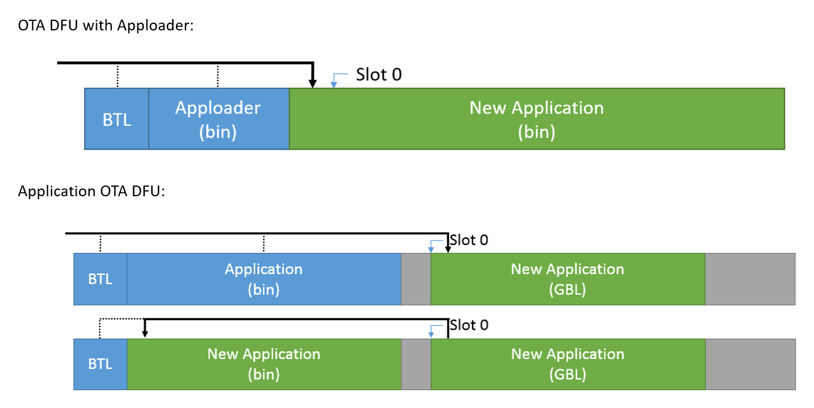
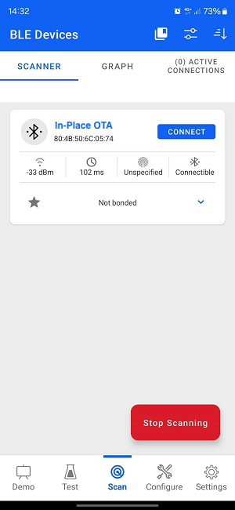
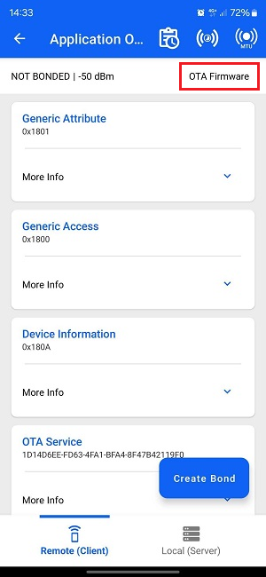
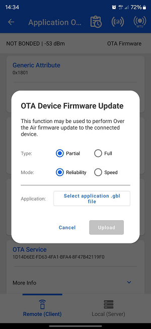

# SoC - In-Place OTA DFU

This example project demonstrates the In-Place Over-the-Air Device Firmware Upgrade (OTA DFU) service, which uses the Apploader. The Apploader is a special type of bootloader that can receive a new firmware image over Bluetooth and write the new firmware image in place of the current application image (hence its name). Once the download has finished, the device reboots and starts running the new firmware immediately.

 > Note: this example expects the Apploader to be present on your device. For details see the [Troubleshooting](#troubleshooting) section.

## Getting Started

To learn the Bluetooth technology basics, see [UG103.14: Bluetooth® LE Fundamentals](https://www.silabs.com/documents/public/user-guides/ug103-14-fundamentals-ble.pdf).

To get started with Bluetooth and Simplicity Studio, see [QSG169: Bluetooth® Quick-Start Guide for SDK v3.x and Higher](https://www.silabs.com/documents/public/quick-start-guides/qsg169-bluetooth-sdk-v3x-quick-start-guide.pdf).

OTA DFU means the firmware upgrade image is sent to the device via a Bluetooth connection. The new firmware can be uploaded either by Apploader (the special bootloader described above) or by the user application. Each solution has its own advantages and disadvantages:
* Apploader runs independently of the user application and can overwrite the old application directly, without an internal step. This is useful if there is no extra storage space. It is also a safe solution because, even if there is a serious bug in the user application, the device can still be started in DFU mode and new firmware can be installed without issues.
* Application OTA DFU means that the image is uploaded during the user application's runtime. This needs extra storage space (since the application cannot overwrite itself). On the other hand, it allows checking the validity of the firmware upgrade image before installation and offers more configurability and interactivity during the DFU sequence.

This example project demonstrates In-Place OTA DFU, which uses the Apploader to upload and install a new firmware image by overwriting the current application.

To learn more about Device Firmware Upgrade, see [AN1086: Using the Gecko Bootloader with the Silicon Labs Bluetooth® Applications](https://www.silabs.com/documents/public/application-notes/an1086-gecko-bootloader-bluetooth.pdf).

## Features Implemented in the Example

This example demonstrates how to use the In-Place OTA DFU software component.

* A simple application is implemented in the event handler function that starts advertising on boot (and on connection_closed event). This enables remote devices to find the device and connect to it.

* A simple GATT database is defined by adding Generic Access and Device Information services. This allows remote devices to read some basic information, such as the device name.

* The In-Place OTA DFU software component is added, which extends both the event handlers (see `sl_bt_in_place_ota_dfu.c`) and the GATT database (OTA DFU service). This enables rebooting the device in DFU mode.

## Testing the Example

This is a minimal example with the In-place OTA service that enables rebooting the device in DFU mode. The rest of the firmware update process is managed by the Apploader. To test this update feature do the following:

1. Build the example solution and flash the combined bootloader + application binary to your device. (See [Troubleshooting](#troubleshooting) section.)
1. Modify the code so that you can differentiate the old and the new firmware (e.g., change the device name in the GATT database).
1. Optionally, you can modify the *create_gbl* step in the *Post-Build Editor (PBE)*. You can learn more about generating GBL files using the *Post-Build Editor* in [Simplicity Studio 5 Users Guide: Post-Build Editor (PBE)](https://docs.silabs.com/simplicity-studio-5-users-guide/latest/ss-5-users-guide-building-and-flashing/post-build-editor).
1. Build the project again, but do not flash.
1. Observe that a GBL (Gecko Bootloader) file is generated automatically along with the build artifacts. The filename is something similar to *bt_soc_in_place_ota_dfu.gbl* but may vary based on the project variant. Copy this file to your smartphone.
1. Download the **Simplicity Connect** smartphone application available on [iOS](https://apps.apple.com/us/app/simplicity-connect/id1030932759) and [Android](https://play.google.com/store/apps/details?id=com.siliconlabs.bledemo&hl=en&gl=US).
1. Open the app and choose the [Scan] option.
   
1. Now you should find your device advertising as "In-Place OTA". Tap **Connect**.
   
1. The connection is opened, and the GATT database is automatically discovered. Find the device name characteristic under Generic Access service and try to read out the device name.
1. Select **OTA Firmware** option.
   
1. Use the Partial OTA tab (default)
   
1. Select the *bt_soc_in_place_ota_dfu.gbl* file and tap **Upload** to start the OTA transfer.
1. Once it's done, tap **END** to finalize the process.
1. Verify that the new firmware has started by checking the modified device name in Simplicity Connect.

## Troubleshooting

### Bootloader Issues

This example solution includes 2 projects: the application example and the Apploader.
When flashing this solution to the device, make sure to select the combined binary from the `artifact` folder.
This combined binary is named after the example solution, e.g. `bt_soc_in_place_ota_dfu_btl.s37`.

Flashing only the application binary (e.g., `bt_soc_in_place_ota_dfu.s37`) will work only if the Apploader is already present on the device.

### Programming the Radio Board

Before programming the radio board mounted on the mainboard, make sure the power supply switch is in the AEM position (right side) as shown below.

## Resources

[Bluetooth Documentation](https://docs.silabs.com/bluetooth/latest/)

[UG103.14: Bluetooth® LE Fundamentals](https://www.silabs.com/documents/public/user-guides/ug103-14-fundamentals-ble.pdf)

[QSG169: Bluetooth® Quick-Start Guide for SDK v3.x and Higher](https://www.silabs.com/documents/public/quick-start-guides/qsg169-bluetooth-sdk-v3x-quick-start-guide.pdf)

[UG434: Silicon Labs Bluetooth ® C Application Developer's Guide for SDK v3.x](https://www.silabs.com/documents/public/user-guides/ug434-bluetooth-c-soc-dev-guide-sdk-v3x.pdf)

[AN1086: Using the Gecko Bootloader with the Silicon Labs Bluetooth® Applications](https://www.silabs.com/documents/public/application-notes/an1086-gecko-bootloader-bluetooth.pdf)

[Bluetooth Training](https://www.silabs.com/support/training/bluetooth)

[Uploading Firmware Images Using OTA DFU](https://docs.silabs.com/bluetooth/latest/general/firmware-upgrade/uploading-firmware-images-using-ota-dfu)

## Report Bugs & Get Support

You are always encouraged and welcome to report any issues you found to us via [Silicon Labs Community](https://www.silabs.com/community).
