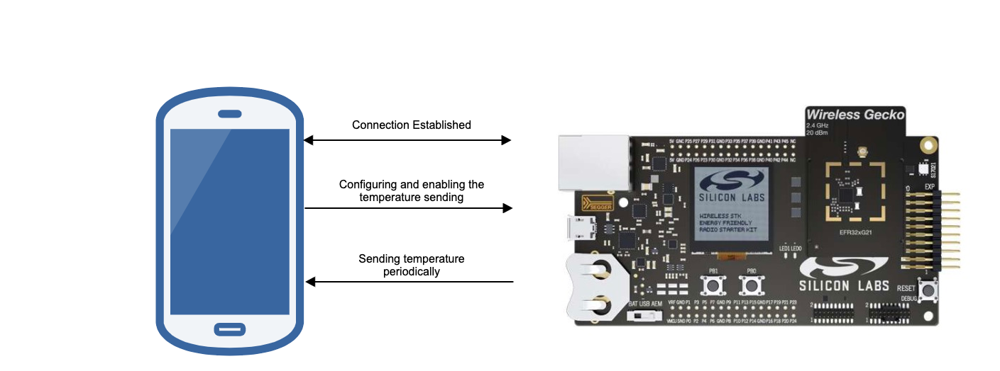
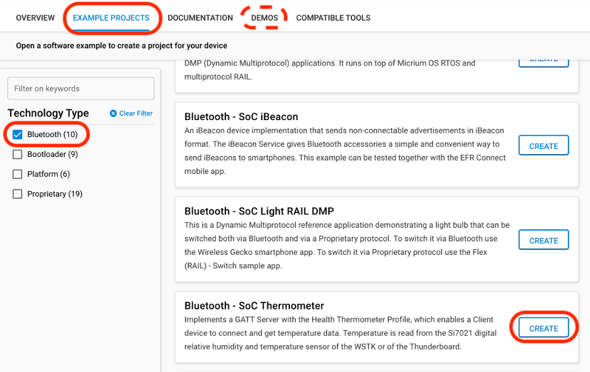
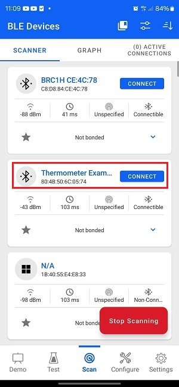
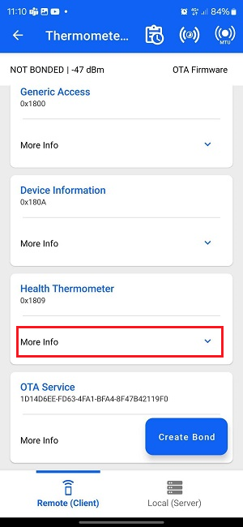
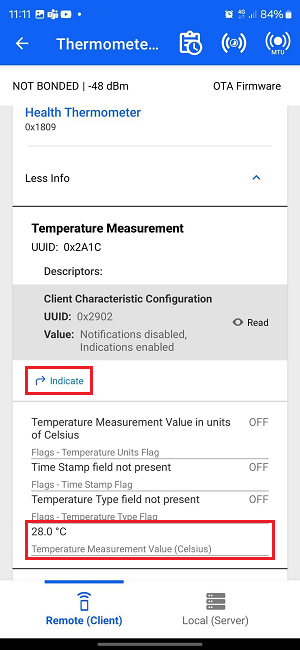
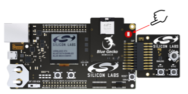
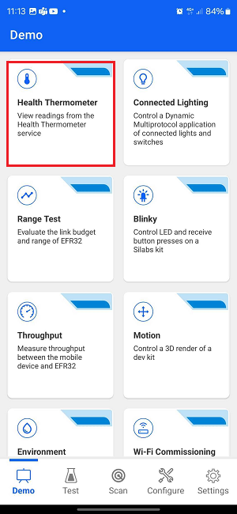
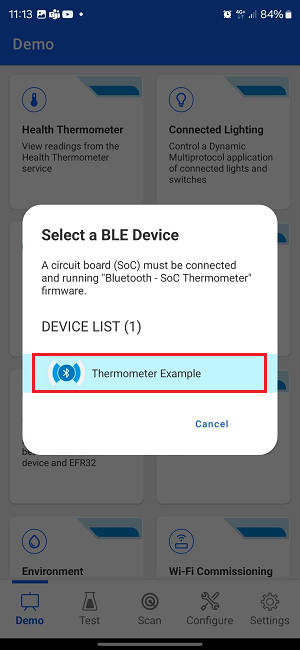
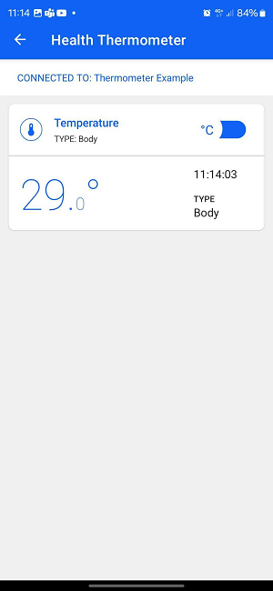

# SoC - Thermometer

This example implements the Health Thermometer service. It enables a peer device to connect and receive temperature values via Bluetooth. The reported values are measured by a temperature sensor located on the mainboard.

> Note: This example does not include Device Firmware Update (DFU) functionality by default. For details see the [Device Firmware Update](#device-firmware-update) section.

## Getting Started

To get started with Silicon Labs Bluetooth and Simplicity Studio, see [QSG169: Bluetooth SDK v3.x Quick Start Guide](https://www.silabs.com/documents/public/quick-start-guides/qsg169-bluetooth-sdk-v3x-quick-start-guide.pdf).

This example implements the predefined [Thermometer Service](https://www.bluetooth.com/xml-viewer/?src=https://www.bluetooth.com/wp-content/uploads/Sitecore-Media-Library/Gatt/Xml/Services/org.bluetooth.service.health_thermometer.xml). To run this example, you will need:

- A mainboard with Bluetooth Low Energy-compatible [radio board](https://www.silabs.com/wireless/bluetooth).
- An *[iOS](https://itunes.apple.com/us/app/silicon-labs-blue-gecko-wstk/id1030932759?mt=8)* or *[Android](https://play.google.com/store/apps/details?id=com.siliconlabs.bledemo)* smartphone with Simplicity Connect app installed.

The following picture shows the system view of how it works.

Follow these steps to get the temperature value on your smartphone.

1. Create the soc-thermometer project based on your hardware, then build and flash the image to your board. Alternatively, you could flash the pre-built demo image.

2. Open the *Simplicity Connect* app on your smartphone and allow the permission requested the first time it is opened.

3. Click [Scan]. You will see a list of nearby devices that are sending Bluetooth advertisement. Find the one named "Thermometer Example" and click the `connect` button on the right side.

4. Wait for the connection to establish and GATT database to be loaded, then find the *Health Thermometer* service, and click `More Info`.

5. Four characteristics will show up. Find the *Temperature Measurement* and press the `indicate` button. Then, you will see the temperature value getting updated periodically. You should also see the temperature displayed change as you press the top of the sensor with your finger, as shown below. If your board is not connected to a temperature sensor (e.g., because of a limited number of available pins), a generated value will be shown which changes 1 degree Celsius every second.

Alternatively, you can follow the steps below instead of steps 3-5 to use the Health Thermometer feature in the app. This will automatically scan and list devices advertising the Health Thermometer service and, upon connection, will automatically enable notifications and display the temperature data.

## Device Firmware Update

This example project does not include Device Firmware Update (DFU) functionality by default, but it can be added easily.
SoC applications can use one of Silicon Labs' Over-the-Air (OTA) DFU implementations. The table below summarizes the options:

|                           | In-place OTA DFU                 | Application OTA DFU                 |
|---------------------------|----------------------------------|-------------------------------------|
| **Component to add**      | In-place OTA DFU                 | Application OTA DFU                 |
| **Compatible bootloader** | Bluetooth Apploader OTA DFU      | Bootloader - SoC Internal Storage (Series 2)   Bootloader - SoC Storage (Series 3) |
| **Reference solution**    | Bluetooth - SoC In-Place OTA DFU | Bluetooth - SoC Application OTA DFU |
| **Supported devices**     | Supports Series 2 devices only and requires a smaller flash size | Supports Series 2 and Series 3 devices with enough flash to store firmware images in 2 instances |

To add DFU to an existing project:
- Add the appropriate DFU component to your project using Simplicity Studio’s Software Component browser.
- Add a post-build step to generate the GBL (Gecko Bootloader) file using Simplicity Studio’s Post Build Editor.
- Rebuild the project.
- Flash a compatible bootloader to the device.

For more information on bootloaders, see [UG103.6: Bootloader Fundamentals](https://www.silabs.com/documents/public/user-guides/ug103-06-fundamentals-bootloading.pdf) and [UG489: Silicon Labs Gecko Bootloader User's Guide for GSDK 4.0 and Higher](https://www.silabs.com/documents/public/user-guides/ug489-gecko-bootloader-user-guide-gsdk-4.pdf).

## Troubleshooting

### Programming the Radio Board

Before programming the radio board mounted on the mainboard, make sure the power supply switch is in the AEM position (right side) as shown below.

## Resources

[Bluetooth Documentation](https://docs.silabs.com/bluetooth/latest/)

[UG103.14: Bluetooth LE Fundamentals](https://www.silabs.com/documents/public/user-guides/ug103-14-fundamentals-ble.pdf)

[QSG169: Bluetooth SDK v3.x Quick Start Guide](https://www.silabs.com/documents/public/quick-start-guides/qsg169-bluetooth-sdk-v3x-quick-start-guide.pdf)

[UG434: Silicon Labs Bluetooth ® C Application Developer's Guide for SDK v3.x](https://www.silabs.com/documents/public/user-guides/ug434-bluetooth-c-soc-dev-guide-sdk-v3x.pdf)

[Bluetooth Training](https://www.silabs.com/support/training/bluetooth)

[Bluetooth SIG thermometer profile specification](https://www.bluetooth.org/docman/handlers/downloaddoc.ashx?doc_id=238687&_ga=2.28821308.120082263.1538382903-201228904.1529395147)

## Report Bugs & Get Support

You are always encouraged and welcome to report any issues you found to us via [Silicon Labs Community](https://www.silabs.com/community).