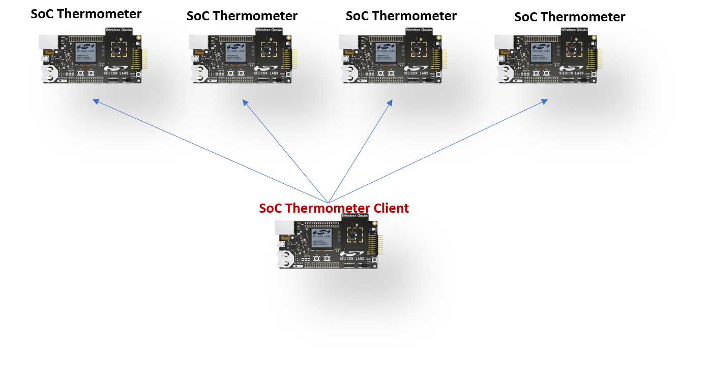
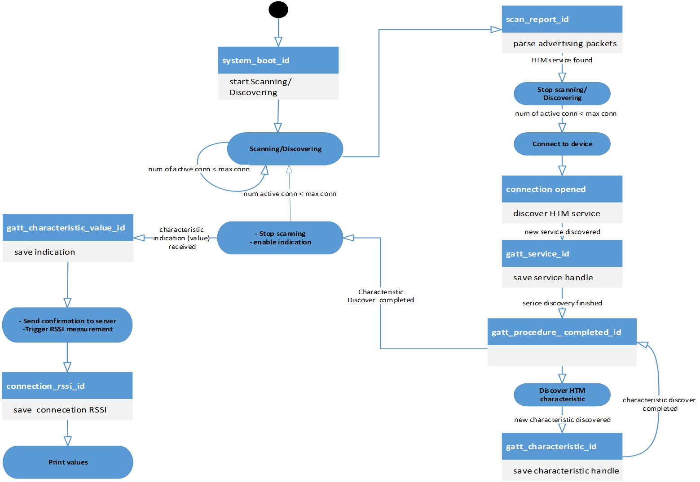
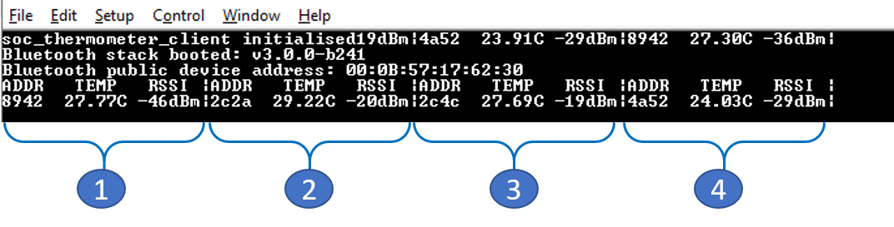

# SoC - Thermometer Client

This example demonstrates the operation of a client device in a multi-peripheral Bluetooth LE (BLE) topology. The Silicon Labs Bluetooth stack supports simultaneous connections for up to eight peripheral devices at one time. This example application illustrates how to handle simultaneous connection to four thermometer peripheral devices.

> Note: This example does not include Device Firmware Update (DFU) functionality by default. For details see the [Device Firmware Update](#device-firmware-update) section.

## Getting Started

To get started with Silicon Labs Bluetooth and Simplicity Studio, see [QSG169: Bluetooth SDK v3.x Quick Start Guide](https://www.silabs.com/documents/public/quick-start-guides/qsg169-bluetooth-sdk-v3x-quick-start-guide.pdf).

To get familiar with client and server roles, see [GATT Server and Client Roles](https://docs.silabs.com/bluetooth/latest/general/gatt-protocol/gatt-server-and-client-roles).

To learn more about central and peripheral roles, see [Central and Peripheral Roles](https://docs.silabs.com/bluetooth/latest/general/connections/central-and-peripheral-roles).

To learn more about multi-peripheral BLE topology, see [Multi-Peripheral Topology](https://docs.silabs.com/bluetooth/latest/general/connections/multiperipheral-topology).

You may also like to read [Bluetooth Connection Flowcharts](https://docs.silabs.com/bluetooth/latest/general/connections/bluetooth-connection-flowcharts) to understand the BLE connection procedures.

## Evaluating the Application

To evaluate this application, you need one EFR32/BGM device running the **SoC Thermometer Client** example application, and at least one (but no more than four) peripheral devices running the **SoC Thermometer** application. The following figure shows the topological setup for testing this example.

When the client boots, it starts `Sanning`/`Discovering` advertising devices. It initiates a connection with those devices that contain the `Health Thermometer` service in their advertising packets.

After a connection is established, the client discovers the Health Thermometer service from the remote GATT database. After the service discovery is completed, the client discovers the thermometer characteristics and enables indications sent from a remote GATT server. The main GATT procedures are represented in the following state diagram.

After programming the devices, open your terminal emulator and connect to your client device over its serial port. Set baud rate to 115200. Power on the peripheral thermometer devices and observe the output readings on your terminal.

## Device Firmware Update

This example project does not include Device Firmware Update (DFU) functionality by default, but it can be added easily.
SoC applications can use one of Silicon Labs' Over-the-Air (OTA) DFU implementations. The table below summarizes the options:

|                           | In-place OTA DFU                 | Application OTA DFU                 |
|---------------------------|----------------------------------|-------------------------------------|
| **Component to add**      | In-place OTA DFU                 | Application OTA DFU                 |
| **Compatible bootloader** | Bluetooth Apploader OTA DFU      | Bootloader - SoC Internal Storage (Series 2)   Bootloader - SoC Storage (Series 3) |
| **Reference solution**    | Bluetooth - SoC In-Place OTA DFU | Bluetooth - SoC Application OTA DFU |
| **Supported devices**     | Supports Series 2 devices only and requires a smaller flash size | Supports Series 2 and Series 3 devices with enough flash to store firmware images in 2 instances |

To add DFU to an existing project:
- Add the appropriate DFU component to your project using Simplicity Studio’s Software Component browser.
- Add a connectable advertisement to your project.
- Add a post-build step to generate the GBL (Gecko Bootloader) file using Simplicity Studio’s Post Build Editor.
- Rebuild the project.
- Flash a compatible bootloader to the device.

For more information on bootloaders, see [UG103.6: Bootloader Fundamentals](https://www.silabs.com/documents/public/user-guides/ug103-06-fundamentals-bootloading.pdf) and [UG489: Silicon Labs Gecko Bootloader User's Guide for GSDK 4.0 and Higher](https://www.silabs.com/documents/public/user-guides/ug489-gecko-bootloader-user-guide-gsdk-4.pdf).

## Troubleshooting

### Programming the Radio Board

Before programming the radio board mounted on the mainboard, make sure the power supply switch is in the AEM position (right side) as shown below.

## Resources

[Bluetooth Documentation](https://docs.silabs.com/bluetooth/latest/)

[UG103.14: Bluetooth LE Fundamentals](https://www.silabs.com/documents/public/user-guides/ug103-14-fundamentals-ble.pdf)

[QSG169: Bluetooth SDK v3.x Quick Start Guide](https://www.silabs.com/documents/public/quick-start-guides/qsg169-bluetooth-sdk-v3x-quick-start-guide.pdf)

[UG434: Silicon Labs Bluetooth ® C Application Developer's Guide for SDK v3.x](https://www.silabs.com/documents/public/user-guides/ug434-bluetooth-c-soc-dev-guide-sdk-v3x.pdf)

[Bluetooth Training](https://www.silabs.com/support/training/bluetooth)

## Report Bugs & Get Support

You are always encouraged and welcome to report any issues you found to us via [Silicon Labs Community](https://www.silabs.com/community).
