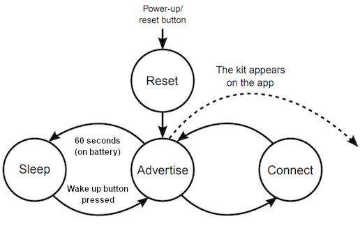
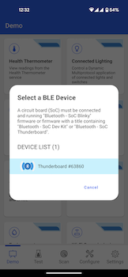
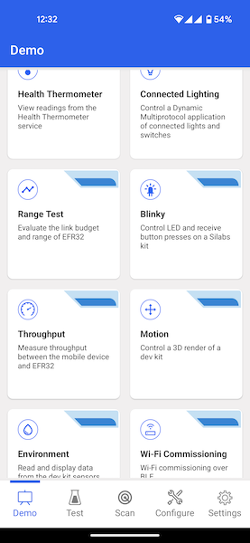
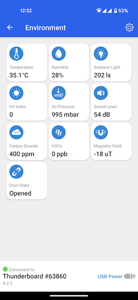
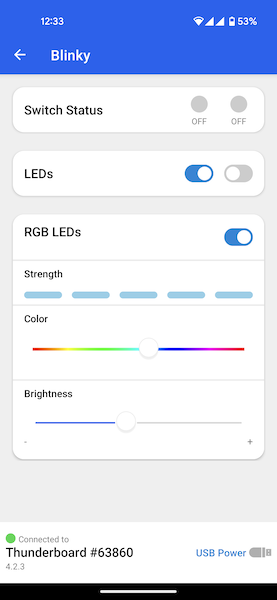
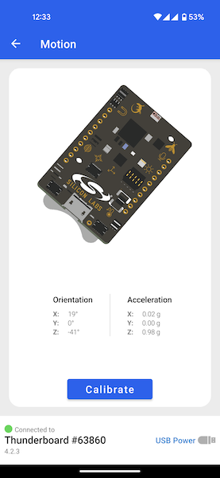

# SoC - Thunderboard / DevKit

This example collects and processes sensor data from a Thunderboard or DevKit board and gives immediate graphical feedback through the Simplicity Connect iOS/Android application.

> Note: not all Thunderboards and DevKits have the full sensor set available. The app will only show the available sensors.

> Note: this example expects a specific Gecko Bootloader to be present on your Thunderboard / DevKit device. For details see the [Troubleshooting](#troubleshooting) section.

## Getting Started

To get started with Silicon Labs Bluetooth and Simplicity Studio, see [QSG169: Bluetooth® Quick-Start Guide for SDK v3.x and Higher](https://www.silabs.com/documents/public/quick-start-guides/qsg169-bluetooth-sdk-v3x-quick-start-guide.pdf).

To run this example, you need either a Thunderboard or a DevKit board, a mobile device, and the Simplicity Connect mobile application, available for [iOS](https://apps.apple.com/us/app/id1030932759) and [Android](https://play.google.com/store/apps/details?id=com.siliconlabs.bledemo).

### Project Setup

The available sensors are different based on the board you use. For a list of the available features, see the User's Guide for the respective board.

After flashing the demo, the board starts to advertise. If the board is powered by battery, it goes into deep sleep mode (Energy Mode 4) after 60 seconds. It wakes up when the push button BTN0 or BTN1 is pressed. To check which button is capable of sending the EM4 Wake-Up signal, see the User's Guide of the board.

The state diagram of the firmware is shown below.

 

There are a number of tiles available in the Simplicity Connect app under the Demo tab. Select a demo by tapping it, then connect to a Thunderboard or DevKit board.

By selecting the *Environment* tile you can see the values of the different sensors mounted on the board, as shown below:

 

Within the *Blinky* tile you can control the LEDs on the board and see the state of the push buttons:

Inside the *Motion* tile, you will see a 3D image of the board. Note, that the orientation changes when you move the board, as shown below:

## Project Structure

The project code is the same for all Thunderboard / DevKit boards. The different sensor configurations are set in the automatically-generated *sl_component_catalog.h*. The main application file, *app.c*, configures the project accordingly.

The Bluetooth-related event handling is implemented in the function `sl_bt_on_event`.

The projects contain the needed services in the GATT database. GATT definitions can be extended using the GATT Configurator, which can be found under the Configuration Tools tab. To learn how to use the GATT Configurator, see [UG438: GATT Configurator User’s Guide for Bluetooth SDK v3.x](https://www.silabs.com/documents/public/user-guides/ug438-gatt-configurator-users-guide-sdk-v3x.pdf).

The sensors and I/O are also handled in this file by overriding the default weak implementation of the service handling functions.

Additional functionality can be added to the empty sl_app_process_action function.

## Troubleshooting

### Bootloader Issues

This example solution includes 2 projects: the application example and a compatible bootloader.
When flashing this solution to the device, make sure to select the combined binary from the `artifact` folder.
This combined binary is named after the example solution, e.g. `bt_soc_iop_test_btl.s37`.

Flashing only the application binary (e.g., `bt_soc_iop_test.s37`) will work only if a compatible bootloader is already present on the device.

You can also decide to remove the DFU functionality by uninstalling the *In-Place OTA DFU* software component. This will automatically put your application code to the start address of the flash, which means that a bootloader is no longer needed, but also that you will not be able to upgrade your firmware.

## Resources

[Bluetooth Documentation](https://docs.silabs.com/bluetooth/latest/)

[UG103.14: Bluetooth LE Fundamentals](https://www.silabs.com/documents/public/user-guides/ug103-14-fundamentals-ble.pdf)

[QSG169: Bluetooth SDK v3.x Quick Start Guide](https://www.silabs.com/documents/public/quick-start-guides/qsg169-bluetooth-sdk-v3x-quick-start-guide.pdf)

[UG434: Silicon Labs Bluetooth® C Application Developer's Guide for SDK v3.x](https://www.silabs.com/documents/public/user-guides/ug434-bluetooth-c-soc-dev-guide-sdk-v3x.pdf)

[Bluetooth Training](https://www.silabs.com/support/training/bluetooth)

## Report Bugs & Get Support

You are always encouraged and welcome to report any issues you found to us via [Silicon Labs Community](https://www.silabs.com/community).
