# ESL Access Point
----
This Python example implements the functionality of an Access Point as specified by the Bluetooth Electronic Shelf Label Profile specification using an NCP ESL AP target. The following features are offered by this example application:

- Finding advertising ESL Tags
- Connecting and configuring Tags either automatically or with full manual control
- Transfer images to Tags via Object Transfer Service (OTS)
- Sending commands to Tags either via Periodic Advertisements with Responses or to the ESL Control Point

Please refer to our [Application Note 1419](https://www.silabs.com/documents/public/application-notes/an1419-ble-electronic-shelf-label.pdf) for full details of setting up and using the ESL network, including detailed usage examples and demo.

Table of content:
- [ESL Access Point](#esl-access-point)
  - [Features](#features)
  - [Limitations, known issues](#limitations-known-issues)
  - [Project structure](#project-structure)
  - [Getting started](#getting-started)
    - [Pre-steps before building](#pre-steps-before-building)
    - [Building the shared libraries](#building-the-shared-libraries)
    - [Starting AP application](#starting-ap-application)
  - [Application startup commandline arguments](#application-startup-commandline-arguments)
    - [Positional parameter](#positional-parameter)
      - [conn](#conn)
    - [Optional arguments](#optional-arguments)
      - [h, --help](#h---help)
      - [m, --cmd](#m---cmd)
      - [d, --demo](#d---demo)
      - [r, --stdout](#r---stdout)
      - [u, --unsecure](#u---unsecure)
      - [l, --log {NOTSET,TRACE,DEBUG,INFO,WARNING,ERROR,CRITICAL}](#l---log-notsettracedebuginfowarningerrorcritical)
      - [e FILE, --exclusive FILE](#e-file---exclusive-file)
  - [Runtime commands](#runtime-commands)
    - [ESL Tag commands](#esl-tag-commands)
      - [ping](#ping)
      - [config](#config)
      - [connect](#connect)
      - [delete\_timed](#delete_timed)
      - [disconnect](#disconnect)
      - [display\_image](#display_image)
      - [image\_update](#image_update)
      - [led](#led)
      - [refresh\_display](#refresh_display)
      - [update\_complete](#update_complete)
      - [unassociate](#unassociate)
      - [factory\_reset](#factory_reset)
      - [service\_reset](#service_reset)
      - [read\_sensor](#read_sensor)
      - [vendor\_opcode](#vendor_opcode)
    - [Access Point control commands](#access-point-control-commands)
      - [help](#help)
      - [mode](#mode)
      - [network](#network)
      - [set\_rssi\_threshold](#set_rssi_threshold)
      - [scan](#scan)
      - [list](#list)
      - [sync](#sync)
      - [demo](#demo)
      - [script](#script)
      - [verbosity](#verbosity)
      - [exit](#exit)

## Features
- Full support of ESL Profile and Service specification v1.1
- Built-in auto conversion for Silabs ESL example devices with image storage and display for any size.
- Multiple connections in parallel up to the limits of the Bluetooth stack on the attached ESL Network Co-Processor embedded target.
- Encrypted communication between the AP script and the embedded target, which can be optionally disabled or completely removed. For more information on building prerequisites of the secure components for the NCP, see chapter 4.2 of the SiLabs application note [AN-1259](https://www.silabs.com/documents/public/application-notes/an1259-bt-ncp-mode-sdk-v3x.pdf).
- Leverage the Filter Accept List and Initiator Filter Policy Core features for improved ESL network initialization performance compared to traditional connection initiation method.
- Simple chaining in CLI using `;` (semicolon) as separator between consecutive commands
- Simple [scripting](#script) capability

## Limitations, known issues
---
- In some cases, particularly if there are many BLE devices advertising nearby while the AP is scanning for long periods, the AP script may become unresponsive. In this case, it may help to limit the scanning window or reduce the number of nearby advertising devices. If neither of these is possible, it is best to increase the throughput of the NCP VCOM as described in [this article](https://community.silabs.com/s/article/wstk-virtual-com-port-baudrate-setting?language=en_US). After changing the WSTK VCOM speed, please don't forget to update the VCOM Baud rate configuration of the ESL NCP Access Point example also accordingly, then re-build and re-flash the target with the new firmware.
- On Windows, there is also a known issue when running the AP where the debugging trace and command line input can interfere with each other on some terminals if Python's pyreadline3 module is installed, so it is strongly recommended to uninstall it using the command `pip uninstall pyreadline3` before running the AP. To find out if it is installed or not, the command `pip freeze` can be used.
- MSYS2 MinGW bash is not recommended for running ESL Access Point Python example application due to various compatibility issues between the native Windows Python environment and that of MSYS2. Still, the ESL C library has to be build with it.
- Sometimes, especially on systems where Python 2 and 3 environments are installed together, the ESL AP script cannot run due to the way these systems handle the default Python environments. If you experience import problems with Python modules that you are sure are installed for the correct Python version, you may need to modify the PATH environment variable or use a properly set virtual environment for Python 3.
- Using the "Filter Accept List" and "Initiator Filter Policy" significantly increases the connection utilization of the ESL AP NCP, and consequently its memory requirements. For this reason, some supported controllers can only be used up to a limited network size of a few hundred ESL devices, larger networks may require an MCU with more memory and a proportional increase of `SL_BT_CONFIG_BUFFER_SIZE` in the ESL AP NCP project configuration.

## Project structure
---
The Access Point Python application consists of the following files:

- app.py _(entry point)_
- air\_compressor.py
- ap\_cli.py
- ap\_config.py
- ap\_constants.py
- ap\_core.py
- ap\_core\_commands.py
- ap\_core\_event\_handlers\_auto.py
- ap\_core\_event\_handlers\_cli.py
- ap\_core\_event\_handlers\_common.py
- ap\_core\_event\_handlers\_demo.py
- ap\_core\_helpers.py
- ap\_core\_pawr.py
- ap\_core\_pawr\_responses.py
- ap\_core\_scan.py
- ap\_core\_tag\_commands.py
- ap\_core\_utils.py
- ap\_ead.py
- ap\_json\_helper.py
- ap\_logger.py
- ap\_response\_parser.py
- ap\_sensor.py
- ap\_soft_timer.py
- auto\_importer.py
- esl\_command.py
- esl\_key\_lib.py
- esl\_key\_lib\_wrapper.py
- esl\_lib.py
- esl\_lib\_test.py
- esl\_lib\_wrapper.py
- esl\_tag.py
- esl\_tag\_db.py
- image\_converter.py
- qrcode\_generator.py

You can see the logical structure on the following diagram:

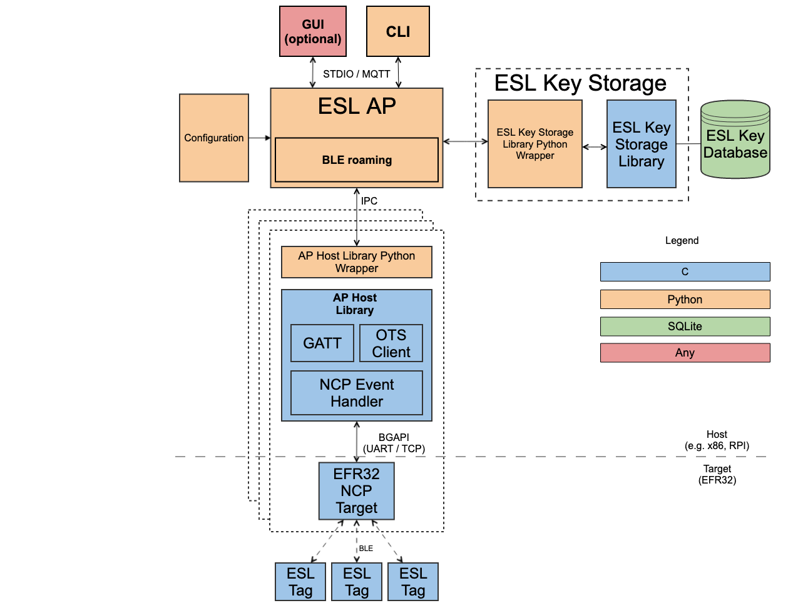

The application has three operation mode: automated and a (semi-) manual mode. The third is the demo mode, which is similar to the manual mode with an additional functionality: it starts advertising a vendor-specific ESL AP GATT Service with two characteristics. The advertising stops if a remote device (e.g mobile phone) established a connection with the AP as peripheral.
If the connection is closed the ESL AP will start the advertising again.

In general, it is possible to control the application via its built-in CLI in any mode - but it is recommended to switch to manual mode with the [`mode`](#mode) command before typing any ESL control commands, because the automated actions may visually interfere with the input. For details on the possible commands, see the ap\_cli.py help file. (Type: [`help`](#help) command in the CLI)

In automated mode the script executes the following functionality:

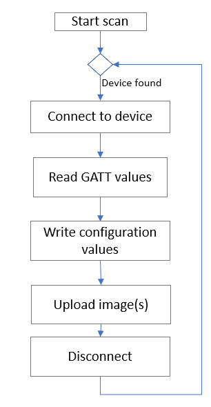

You can see the details of the functionality for each mode in the *<mode>\_esl\_event* function. (e.g *cli\_esl\_event\_system\_boot*)

_Note: Shall any unsolicited error occur during the automated process, the automated cycle above may become interrupted. In most of such cases you can still use the CLI to enter commands, thus it is possible to recover the auto mode._

## Getting started
---
The NCP Host side application requires Python 3. Run `pip install -r requirements.txt` to install all other requirements for the application. Make sure to run this command before creating the project and running `make`. See [Pre-steps before building](#pre-steps-before-building) on how to get a working build environment.

On the target side an EFR device is needed, programmed with the *Bluetooth - NCP ESL Access Point* sample application.

To run the ESL AP Python host example, a preliminary step is required to build the necessary ESL shared libraries which are written in C. As for the build environment and build process, three main operating systems are supported: Windows, Linux and macOS, all of which can be used on any machine architecture.

### Pre-steps before building
For Windows only, the first thing we need is a UNIX-like utility environment, for which we have MSYS2 as a regular tool at Silabs. After downloading and installing MSYS2, we also need to download make utility and the appropriate Minimalist GNU for Windows GCC compiler: to choose the right architecture, we need to know which Python architecture we have, as it needs to compile slightly differently for 64-bit and 32-bit versions.

Please note that if you already have Cygwin installed, installing MSYS2 and MingW may cause problems, so installation in such an environment is not recommended. Instead, we recommend that you keep your regular environment, but you will need to find out what additional components may need to be installed via your package manager, and what configuration may need to be changed,  as we do not provide direct support for Cygwin.

As for the Python version, 3.9 is the oldest supported - but later versions should work as well. On Windows, it is also recommended to install it into a custom directory to avoid unexpected errors later. It is essential that the installed executable environment is not placed in the read-only '*Program Files*' folders, and that the installer is allowed to set the necessary PATH variables. Furtunatelly, no such complications are known to exist with Linux and macOS.

Some possible pitfalls of a Windows installation may happen: the MSYS2 MinGW environment can have a built-in Python interpreter installed in the */usr/bin* or */mingw/bin* folder (`which Python` can be used to find out). Although advanced users will be definitely able to compile with this Python if they know how to fix various errors that may come during the build execution, it is strongly discouraged due to the many potential sources of trouble.
In addition, as it was mentioned earlier, if the native Windows Python is located in Program Files, advanced manual configuration of the PATH environment variable may be also required, without which the build process can stall at the final stage. That's why it's heavily recommended to install it in location that isn't write-protected, as shown in the image below.

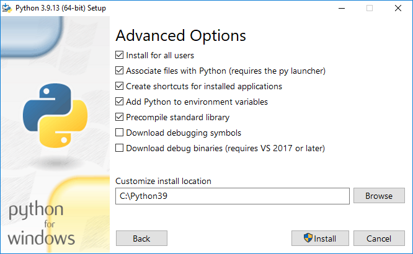

Installing the proper GCC version is also essential. For example, if our Python is 32-bit, but the ESL key library and ESL C library are compiled with GCC for MinGW64, the import will fail and the AP example code will not start. This means either issuing `pacman -S make pkgconf mingw-w64-x86_64-gcc`, or `pacman -S make pkgconf mingw-w64-i686-gcc` in the MinGW32 or MinGW64 bash terminal, depending on Python interpreter architecture. While compilation for 32-bit architectures - and thus, using 32-bit Python interpreter - is still supported, using 64-bit architectures is strongly recommended.

Finally, as we're about to use the systems' native Python environment, the MSYS2 MinGW environment should be started with the `-use-full-path` option. Without this, the compilation will fail as well. That is, start either with `msys2_shell.cmd -mingw32 -use-full-path` or `msys2_shell.cmd -mingw64 -use-full-path` depending on Python.

### Building the shared libraries

Once you have your favourite UNIX environment up and running, the procedure for building our ESL C library is pretty much the same on all supported systems, except that you will need to obtain the library requirements as follows. Before you can build, you'll of course need the build essentials for your system. You'll also need the `sqlite3` and `openssl` libraries with development headers (the latter is often called `libssl-dev` or `openssl-devel`). Due to the existence of many package managers on different systems and distros, this last step may also vary and can't be listed exactly here.

To build the required shared libraries for the Python ESL Access Point, please follow these steps using Simplicity Studio v6:

1. **Open Simplicity Studio and start creating the workspace.**
   - Choose `Bluetooth LE` from the Wireless Technology list on the _Home_ page. This will open the _Project_ on the left and a new _Examples and Demos_ tab on the top.
   - Use the search field to filter with the keyword `esl`.
   - Select `Blutooth` checkbox in the _Wireless Technology_ list and the `Host` option from the _Device Type_ list for better filtering. This will narrow down the list on the right to four elements: three ESL AP related projects and the workspace that combines them.
   - Select the `Bluetooth - Host ESL Access Point` workspace, which groups the three ESL AP host projects together.
     (If you are unsure which one is the workspace, you can hide individual projects for clarity by disabling the visibility of _Example Projects_.)

   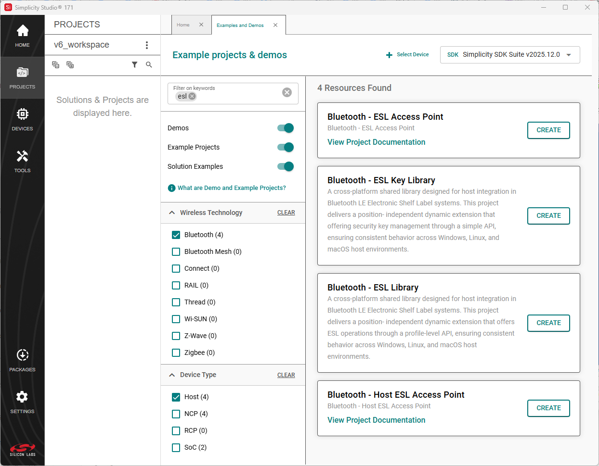

2. **Select your target OS for the ESL Access point.**
   - In the 'Target Device' dropdown, select your target operating system: `linux`, `macos`, or `win32`.
     (Tip: Start typing the OS name to filter the list. Ensure that the _Part_ checkbox on the right is selected.)
   - Once you selected the proper target, press the _Next_ button.

   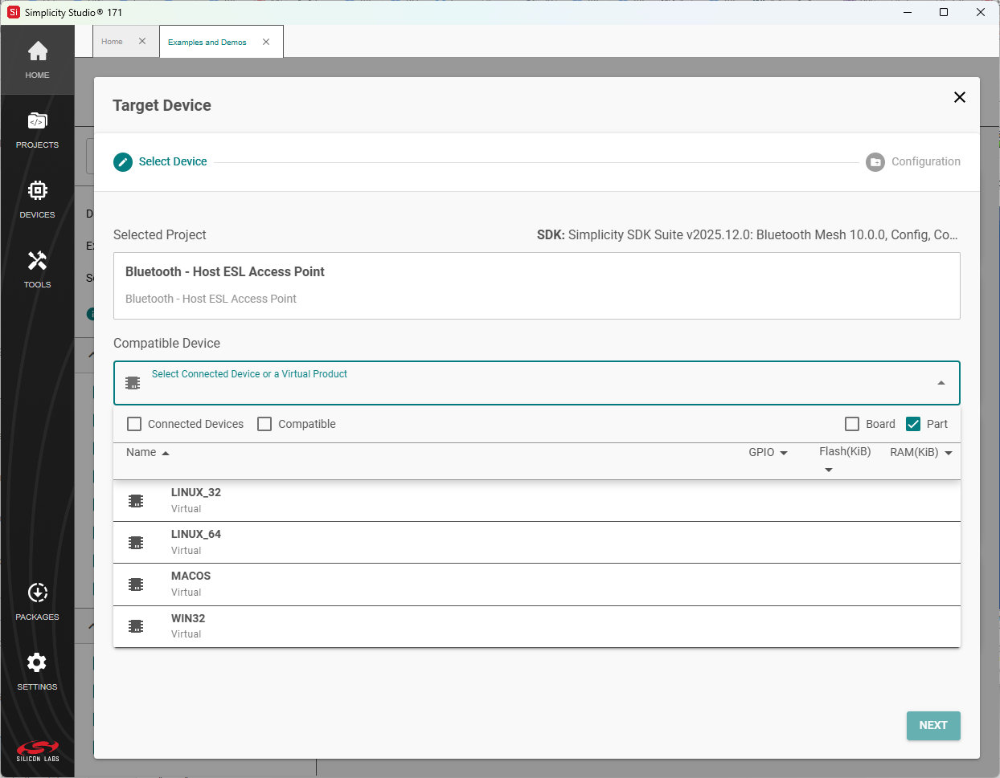


3. **Finalize workspace generation.**
   - On the last page, it is recommended to leave the fields unchanged and keep the default values.
   - At the bottom of this page, select `Makefile (GCC)` from the _Target IDE_ list, then click the _Finish_ button.

   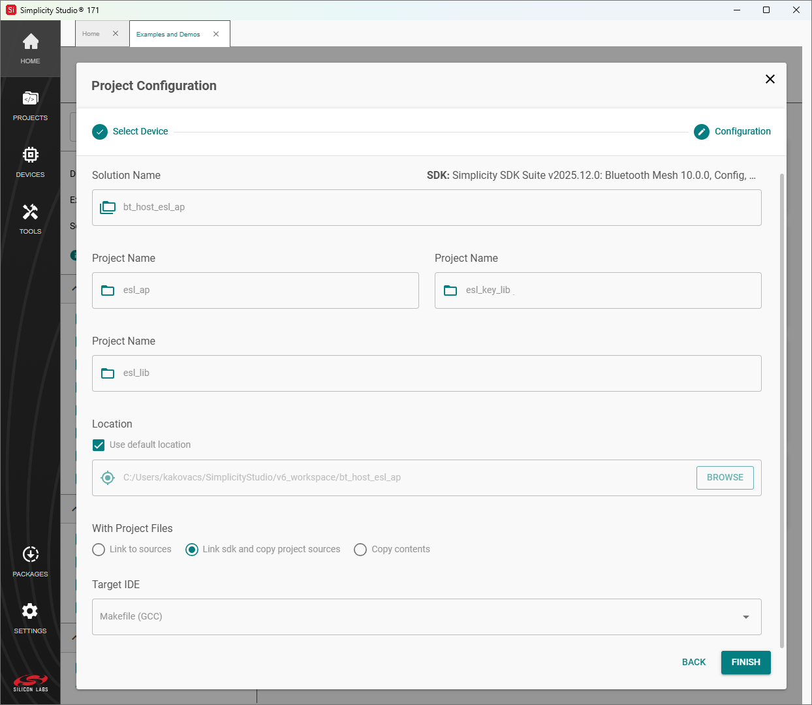

4. **Build the solution.**
   - The workspace will be generated in your chosen directory.
   - Open a terminal and navigate to this directory. On Windows, be sure to use the MinGW terminal that matches your selected target architecture; otherwise, the make process will not complete successfully.
   - Run the following command to build all required shared libraries:
     ```
     make -f bt_host_esl_ap.solution.Makefile
     ```
   - After a successful build, the ESL AP script will be ready to use in the  `esl_ap` project subfolder within the workspace.

### Starting AP application

On Windows, the PowerShell is the preferred running environment, but it can also run under the basic command line. However, using the MSYS2 MinGW bash is not recommended for this purpose due to known compatibility issues between the native Windows Python running environment and that of MSYS2. On other systems like Linux and macOS any terminal can be used.

AP can be run in manual, demo or automatic mode. Without using the [`--cmd`](#m---cmd) or the [`--demo`](#d---demo) command line parameter, automatic mode is started.

The AP must be started from the `esl_ap` project directory (where `app.py` is located).

For example to start AP on Windows system where an NCP is connected to COM4, open a terminal in the `esl_ap` folder and type `python3 .\app.py COM4`. If the AP is the only Silabs board connected to the PC via USB there is no need to specify the COM port. Mode can also be set later runtime using the [`mode`](#mode) command.

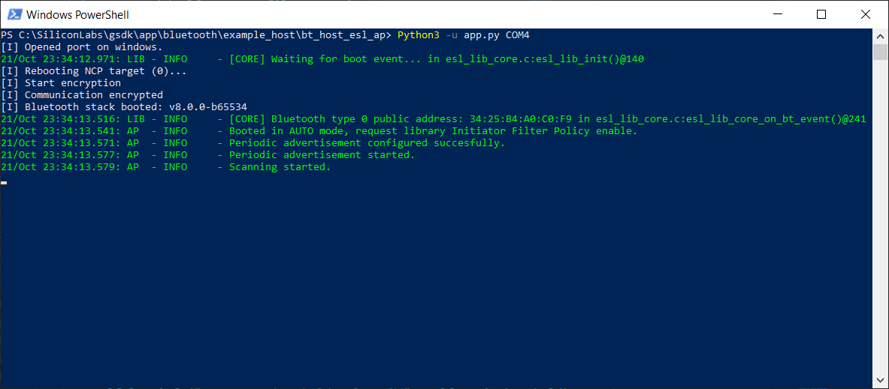

In parallel one or more Tags can be powered on. Once they booted up, the WSTK display will show the following picture (assuming an unmodified *Bluetooth - SoC ESL Tag* example project):

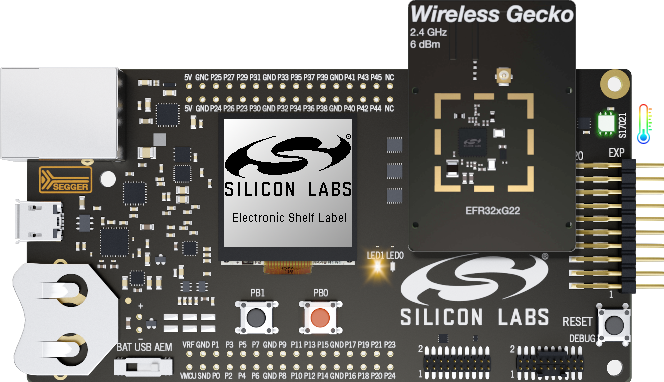

Assuming the automated mode startup above, the already running AP script will find then configure the Tag shortly after with an arbitrary image:

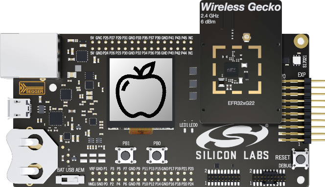

## Application startup commandline arguments
There are a number of command line arguments that can be used to customize the way the ESL AP Python sample application is launched. The list of available options can be queried by passing the `-h` parameter to `app.py` when running.

### Positional parameter

#### conn
    Serial or TCP connection parameter.

  Either the IP address of the development kit where the ESL AP NCP application is running or the name of the serial port to which WSTK's USB CPC device is mapped. For serial ports, the naming convention should follow operating system notation.
  If this parameter is omitted, the application will attempt to find the only Wireless Development Kit running the ESL AP NCP code connected to the machine via the USB CDC port at startup. However, this attempt will fail if there is more than one WDK connected to the host via the USB port, or if the only device does not run the required NCP code. It is therefore recommended, but not mandatory.

### Optional arguments

#### h, --help
    Show help message and exit

#### m, --cmd
    Start in command line (manual) mode instead of default ESL Profile (auto) mode

  By default, the ESL AP starts in ESL Profile (auto) mode, i.e. it strictly follows the behavior described in the ESL Profile specification when detecting ESLs advertising in various states. Also, in auto mode, the found nearby ESLs are configured using auto-generated ESL addresses. In manual mode, however, it is possible to do virtually anything - including violating the profile specification, either intentionally or unintentionally - so use this option with care.

#### d, --demo
    Start in manual mode with Simplicity Connect demo mode enabled

  The Simplicity Connect mobile application offers an ESL demo scene, and this option is designed to streamline the use of that feature. It also enables the `cmd` mode, which allows the Simplicity Connect to act as the management entity.

#### r, --stdout
    Redirect logging output from default stderr to stdout

  This might be useful for test systems that can't handle `stderr` but can handle `stdout`. Otherwise, it is recommended to omit this option, in which case the logging will use `stderr` as its default output, while the built-in CLI will use `stdio` for command processing and result feedback.

#### u, --unsecure
    Disable encryption for NCP communication

  Not recommended for use in a production environment as it renders the TCP/UART communication between the ESL AP and the NCP wireless target unencrypted. For testing purposes only.

#### l, --log {NOTSET,TRACE,DEBUG,INFO,WARNING,ERROR,CRITICAL}
    Logging level to start with - can be changed later with verbosity command

  The default logging level is `INFO`, which strikes a balance between useful information and not too much verbosity. Using `NOTSET` will completely flood the terminal with messages, use it only for serious debugging sessions.

#### e FILE, --exclusive FILE
    Enable exclusive mode based on a JSON file describing an ESL network configuration

  This option allows a complete network configuration to be loaded from an appropriately formatted JSON descriptor file to support automatic addressing logic. Automatic mode can still generate collision-free ESL addresses without this option, but a fully tuned network can only be automatically configured using this method.
  The provided JSON configuration also acts as an allow list, preventing nearby unlisted advertising ESLs from being automatically added to the network. This latter behavior can be useful for test cases as well as in production.
  The JSON file shall follow the format below:

    {
      "group_0": {
        "id_2": "68:0A:E2:28:7E:50",
        "id_3": "68:0A:E2:28:7B:7A"
      },
      "group_1": {
        "id_0": "68:0A:E2:28:8B:96",
        "id_1": "68:0A:E2:28:7E:A3",
        "id_2": "68:0A:E2:28:7E:A4"
      }
    }

A thorough syntactic and semantic analysis of the file will be performed before loading, and the file will only be accepted if it is in the correct format - note, however, that due to some limitations of the JSON format, some (non-fatal) errors such as key duplication will not be detected (e.g. if `group_1` is defined twice in the file, or `id_2` is defined twice in a group, only the later one will be applied). The same 48-bit Bluetooth address cannot occur twice in the file, this will be detected by the validator. The Bluetooth address values are in big-endian format for human readability.

The network behavior can also be controlled at a later time using the built-in CLI command [network](#network) - this startup option just a convenient way to get the AP up and running in exclusive automated mode right away.

It may also be worth mentioning that a given configuration file does not need to be specified over and over again on repeated startups - unless its contents have changed, or the explicit purpose is to use an exclusive startup mode - because after the first successful import and subsequent network configuration, the settings are also recorded in the ESL key database.

## Runtime commands
Unlike the previously described command line arguments that take effect once at program startup, the following commands are used to control a running AP instance at runtime through its built-in command line interface. These commands are used to tune the overall behavior of the AP and to control the parameters of the ESL network being established.

### ESL Tag commands
---

#### ping
    Get the Basic State response of the addressed ESL.

Usage: `ping [-h] [--group_id <u7>] esl_id`

Positional argument:
- `esl_id`:                 ESL ID of the Tag. _Note: `all` also can be used as a broadcast address (0xff) if `IOP_TEST` config is set to `True`. (Although it still makes no sense as broadcast messages doesn't solicit any response by the spec.)_

Option:
- `[--group_id, -g <u7>]`:  ESL group ID (optional, default is group 0)

#### config
    Configure the writable mandatory GATT characteristics of the ESL tag.

Usage: `config [-h] [--full] [--esl_id <u8>] [--group_id <u7>] [--sync_key] [--response_key] [--time | --absolute <u32>] [device]`

Positional argument:
- `[device]`:                     Bluetooth address of the target device (e.g. `AA:BB:CC:DD:EE:22`) in case insensitive format or `all`.

Options:
- `[--full]`:                     Configure everything in one step. ESL ID and group can be specified to override default values - see notes.
- `[--esl_id, -i <esl_id_type>]`: New ESL ID of the connected tag.
- `[--group_id, -g <u7>]`:        New ESL group ID (optional, default is group 0).
- `[--sync_key, -sk]`:            Set current Access Point Sync Key Material.
- `[--response_key, -rk]`:        Generate then set new Response Key Material.
- `[--time, -t]`:                 Set current Absolute Time of the ESL Access Point.
- `[--absolute, -a <u32>]`:       Set custom Absolute Time epoch value - use with care! _Mutually exclusive with the `--time` parameter._

_Notes:_
- _Either the option `--full` or at least one of the optional parameters shall be given._
- _The 'all' keyword can be used to configure a number of connected ESLs, but the ESL ID can't be specified in turn, as this would make the command ambiguous._
- _However, the same ESL group ID can be specified for multiple connected devices - but use this with care, as this command doesn't check against existing ESL configurations, so the network MAY END UP BROKEN!_

Examples:
-  `config --full --absolute 0`

   Will configure everything plus overrides the ESL Absolute Time epoch value for the given tag (e.g. for testing purposes)
-  `config -i 2 -g 3`

   (Re-)configure only ESL ID and group ID - please note that the other ESL Characteristics e.g. Key Materials and Absolute Time will remain unchanged this way, including their unconfigured states if that's the case.
-  `config -i 1 AA:BB:CC:DD:EE:22`

   (Re-)configure only ESL ID while group ID remains unchanged (0 by default if not given before). Bluetooth address shall be given if there are more active connection opened.

#### connect
    Connect to one or more ESL devices.

Usage: `connect [-h] [--group_id <u7>] [--addr_type, -t] [address]`

Positional argument:
- `[address]`               Bluetooth address (e.g. `AA:BB:CC:DD:EE:22`) in case insensitive format or ESL ID of the tag or `all`.

Options:
- `[--group_id, -g <u7>]`:  ESL group ID (optional, default is group 0).
- `[--addr_type, -t]`:      ESL address type (optional), possible values:
    - `public`:             Public device address (default assumption).
    - `static`:             Random static device address.

_Notes:_
- _`<esl_id>` and `<group_id>` can be used instead of `<bt_addr>` if ESL is already configured._
- _`<address_type>` will be taken into account only if the given `<bt_addr>` is unknown - otherwise the proper type reported by the remote device will be used._
- _If the `<group_id>` is not given after the ESL ID then the default value group zero is used. This applies to many commands expecting the group ID as optional parameter._
- _The `all` keyword can be used with a special meaning with `connect` command: it will try to connect to all advertiser ESLs (within the 'group_id' if it is given or to any advertisers if it isn't) up to the the maximum number of simultaneous connections supported by the current build of the ESL library and the attached Network Co-Processor embedded controller._
- _If the group is specified along with the keyword `all`, then only devices in the group will be connected. That is, specifying the group ID will not work with ESLs that are not yet configured._
- _An explicit address type is ignored for an already configured ESL that is addressed by ESL ID. The correct type is already known in this case and will be used instead._

Examples:
- `connect bc:33:ac:fa:57:d0`

   Try connect to the given address - even if it's advertisement is not detected e.g. due disabled scanning. Will fail with timeout if the given address is out of radio range.
- `connect`

   Checks nearby advertisers and connects to one if there's only one. Scan needs to be enabled for this to work.
- `connect all`

   Checks nearby advertisers and connects to all up to the supported number of parallel connections. Scan needs to be enabled for this to work.

#### delete\_timed
    Delete a delayed command of an ESL Tag peripheral with the selected index.

Usage: `delete_timed [-h] [--group_id <u7>] {led,display} esl_id index`

Positional arguments:
- `{led,display}`: Delete timed led or display_image command.
- `esl_id`:        ESL ID of the Tag.
- `index`:         Index of the LED or the display.

Option:
- `[--group_id, -g <u7>]`:  ESL group ID (optional, default is group 0).

#### disconnect
    Initiate the Periodic Advertisement Sync Transfer process if PAwR train is
    available then disconnect from an ESL device with the specified address.

Usage: `disconnect [-h] [--group_id <u7>] [<address>]`

Positional argument:
- `<address>`:  Bluetooth address (e.g. `AA:BB:CC:DD:EE:22`) in case insensitive format or ESL ID of the tag or `all`.

Option:
- `[--group_id, -g <u7>]`:  ESL group ID (optional, default is group 0).

_Notes:_
- _If no address is specified, the default active connection is closed - if only one exists._
- _To close more existing connections at once, you can use the `disconnect all` command._
- _If the group ID is specified with the keyword `all`, then only the devices in the group will be disconnected._

Examples:
- `disconnect bc:33:ac:fa:57:d0`

  Disconnect from the addressed device.
- `disconnect`

  Disconnect from the only existing connection - gives error response if there's none or more than one.
- `disconnect all -g0`

  Disconnect from all connected ESLs that are in group 0.


#### display\_image
    Display desired image on target ESL.

Usage: `display_image [-h] [--group_id <u7>] [--time <hh:mm:ss> | --absolute <u32>] [--delay <u32>] [--date <YYYY-MM-DD>] esl_id image_index display_index`

Positional arguments:
- `esl_id`:                    ESL ID of the Tag.
                               _Note: `all` also can be used as a broadcast address (0xff)._
- `image_index`:               Image index.
- `display_idx`:               Display index.

Options:
- `[--group_id, -g <u7>]`:     ESL group ID (optional, default is group 0).
- `[--time, -t <hh:mm:ss>]`:   Execution time of the command in hour:min:sec format. (optional)
                               _Note: If <--delay> is specified then it is also added to the calculated value as an additional delay._
- `[--absolute, -a <u32>]`:    Execution time of the command in ESL Absolute Time epoch value. Mutually exclusive with timed delay.
- `[--date, -d <YYYY-MM-DD>]`: Execution date of the command in ISO-8601 format (optional to time, only).
- `[--delay, -dy <u32>]`:      Delay in milliseconds (optional).

_Note:_
- _Timed display commands with a delay shorter than the actual periodic advertisement interval may be rejected on receive by Implausible Absolute Time (0x0C) ESL error response._

Example:
- `display_image 17 1 0 --delay=5000`

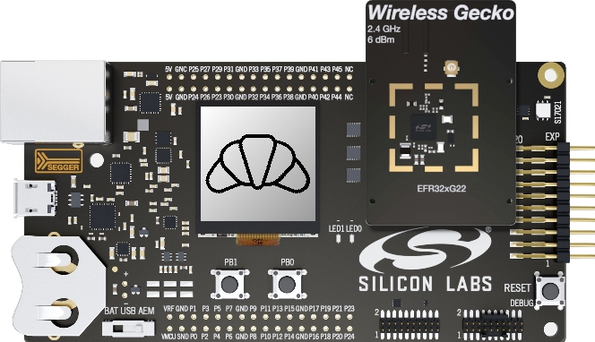

#### image\_update
    Update single image on one or more connected Tags.

Usage: `image_update [-h] [--group_id <u7>] [--label <str>] [--cropfit] [--raw | --display_index <u8>] [--cw | --ccw | --flip] image_index imagefile_path [[address]]`

Positional arguments:
- `image_index`:                Image storage index of the ESL tag to be updated.
- `imagefile_path`:             Relative or full path to the selected image file. Use quotation marks if the path contains spaces.
- `[address]`:                  Bluetooth address of the target device or ESL ID or `all` if there are more ESLs connected.

Options:
- `-h, --help`:                 Show this help message.
- `[--group_id <u7>, -g <u7>]`: ESL group ID (optional, default is group 0)
- `[--label, -l <str>]`:        Caption to be written over the image. Use quotation marks if it includes spaces or line breaks.
- `[--cropfit, -c]`:            Fit the image to the display proportions by cropping.
- `[--raw, -r]`:                Upload raw image file without any conversion.
- `[--display_index, -d <u8>]`: Try auto-conversion image for this display. Mutually exclusive with `--raw` argument.
- `[--cw, -rr]`:                Clockwise (right) rotation.
- `[--ccw, -rl]`:               Counter clockwise (left) rotation.
- `[--flip, -f]`:               Turn the image upside down.
                                _Note: cw, ccw and flip are mutually exclusive_

_Notes:_
- _ESL Tag must be connected to the AP before running this command._
- _The ESL won't display any change after the image upload is complete unless a `display_image` command is also sent with the same image index - or a `refresh_display` command to a display already showing the same image that has changed. Please refer to the `display_image` and `refresh_display` commands' examples._
- _To use space or backslash in the filename or other special characters, such as line break escape sequences in the text caption, please enclose these strings in quotes._
- _The modifiers like rotation, fitting and and labeling are mutually exclusive with raw data input._
- _If the group is specified along with the keyword `all`, then only connected devices in the group will be affected._

Examples:
- `image_update 0 ./image/banana.png --label="Line 1\nLine 2"`

  Send an image to index 0 on the single connected ESL with two lines of label. Note that address is a positional argument yet it can be omitted if there's only one connected device present at the moment.
- `image_update 1 "/user/home/path with space/img.jpg" all`

  Use the 'all' keyword as special address to send the same image to slot 1 on all connected ESLs.

- `image_update 0 *qrcode all`

  To send unique QR codes to all connected tags for use with ESL Demo, enter "*qrcode" instead of a valid image file path. Typically beneficial for ESLs equipped with permanent displays, such as ePaper.

#### led
    Turn on / off or flash an LED utilizing the LED control command.

Usage: `led [-h] [--group_id <u7>] [--default] [--pattern <bits>] [--on_period <u8>] [--off_period <u8>] [--brightness <int[0,3]>] [--color <int[0,3]>] [--repeats <u15> | --duration <u15>] [--index <u8>] [--time <hh:mm:ss> | --absolute <u32>] [--delay <u32>] [--date YYYY-MM-DD] {on,off,flash} esl_id`

Positional arguments:
- `{on,off,flash}`:                 Turn ON/OFF LED or flash LED based on a bit pattern.
- `esl_id`:                         ESL ID of the Tag. _Note: `all` also can be used as a broadcast address (0xff)._

Options:
- `[--group_id, -g <u7>]`:          ESL group ID (optional, default is group 0).
- `[--default, -d]`:                Restore the default flashing pattern built-in with AP.
- `[--pattern, -p <bits>]`:         A string containing either `1`s or `0`s, max length: 40.
- `[--on_period, -on <u8>]`:        Integer value from 1 to 255, meaning `delay *2ms` for on state bits of the pattern. `0` is prohibited.
- `[--off_period, -of <u8>]`:       Integer value from 1 to 255, meaning `delay *2ms` for off state bits of the pattern. `0` is prohibited.
- `[--brightness, -b <int[0,3]>]`:  4 step brightness from 0 to 3.
- `[--color, -c <int[0,3]>]`:       Red, green and blue values - only applies to LED with sRGB type.
- `[--repeats, -r <u15>]`:          How many times the pattern shall be repeated. Mutually exclusive with `--duration` parameter. Value set is [1-32767].
- `[--duration, -dn <u15>]`:        How many seconds the pattern shall be repeated. Mutually exclusive with `--repeats` parameter. Value set is [1-32767].
- `[--index, -i <u8>]`:             Index of the LED (optional, default 0).
- `[--time, -t <hh:mm:ss>]`:        Execution time of the command in hour:min:sec format. (optional)
                                    _Note: If `<--delay>` is specified then it is also added to the calculated value as an additional delay._
- `[--absolute, -a <u32>]`:         Execution time of the command in ESL Absolute Time epoch value. Mutually exclusive with timed delay.
- `[--date, -dt YYYY-MM-DD]`:       Execution date of the command in ISO-8601 format (optional to time, only).
- `[--delay, -dy <u32>]`:           Delay in milliseconds (optional).

Example: `led flash 17 --index=1 --pattern=101100111000 --time=16:18:00`

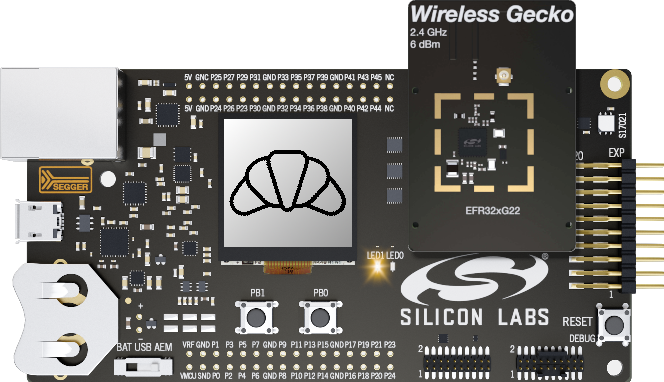

_Notes:_
- _Arguments controlling flashing parameters are ignored for 'on' and 'off' commands._
- _Color and brightness control parameters are useless for 'off' command._
- _Timed LED commands with a delay shorter than the actual periodic advertisement interval may be rejected on receive by Implausible Absolute Time (0x0C) ESL error response. Please refer the ESL specification on timed commands._
- _If the delay is given in the human readable form (using `--time`) then the LED will either turn on on the same day at the specified time or the next day - the latter if the given time has passed already on your local computer's clock!_
- _In the SoC ESL Tag example the LED at index 0 is used for special purposes, that is it can't be controlled directly as opposed to LED 1 on the WSTK. Rather, LED 0 is used as optical feedback only for various internal states of the ESL Tag. Nevertheless, the special function for LED 0 can be still switched on and off via the `led` command._
- _Almost all of the optional led control parameters are "sticky", meaning that the last values are preserved by the AP internally and will be re-used next time, if the given parameter is omitted in the argument list. This doesn't apply on the delay, time and absolute parameters, though._

#### refresh\_display
    Refresh ESL Tag display.

Usage: `refresh_display [-h] [--group_id <u7>] esl_id display_index`

Positional arguments:
- `esl_id`:                ESL ID of the Tag. _Note: `all` also can be used as a broadcast address (0xff)._
- `display_id`:            Display index.

Option:
- `[--group_id, -g <u7>]`: ESL group ID (optional, default is group 0).

#### update\_complete
    Send Update Complete ESL opcode.
Usage: `update_complete [-h] [--group_id <u7>] [address]`

Positional argument:
- `[address]`:             Bluetooth address (e.g. `AA:BB:CC:DD:EE:22`) in case insensitive format or ESL ID of the tag or `all`.

Option:
- `[--group_id, -g <u7>]`: ESL group ID (optional, default is group 0).

_Notes:_
- _The `update_complete` command works only in IOP test mode!_
- _If the group is specified along with the keyword `all`, then only connected devices in the group will be affected._

#### unassociate
    Unassociate Tag from AP.

Usage: `unassociate [-h] [--group_id <u7>] address`

Positional argument:
- `address`:                Bluetooth address in case insensitive format or ESL ID of the Tag.
                            _Note: `all` also can be used as a broadcast address (0xff)._
Option:
- `[--group_id, -g <u7>]`:  ESL group ID (optional, default is group 0).

Example: `unassociate 17 -g 2`

#### factory\_reset
    Reset ESL to a state when it was not associated with the AP.
    It means ESL deletes all configuration value set by the AP including image data.

Usage: `factory_reset [-h] [--group_id <u7>] [--pawr] address`

Positional argument:
- `address`:                Bluetooth address in case insensitive format or ESL ID of the Tag.
                            _Note: `all` also can be used as a broadcast address (0xff)._
Options:
- `[--group_id, -g <u7>]`:  ESL group ID (optional, default is group 0).
- `[--pawr]`:               Force command through PAwR sync train even if the addressed ESL is currently connected.

#### service\_reset
    Send Service Reset command.

Usage: `service_reset [-h] [--group_id <u7>] esl_id`

Positional argument:
- `esl_id`:                 ESL ID of the tag. _Note: `all` also can be used as a broadcast address (0xff)._

Option:
- `[--group_id, -g <u7>]`:  ESL group ID (optional, default is group 0).

#### read\_sensor
    Read sensor information.

Usage: ` read_sensor [-h] [--group_id <u7>] esl_id sensor_index`

Positional arguments:
- `esl_id`:                 ESL ID of the tag.
- `sensor_index`:           Sensor index.

Option:
- `[--group_id, -g <u7>]`:  ESL group ID (optional, default is group 0).

#### vendor\_opcode
    Send generic ESL vendor specific command.

Usage: `vendor_opcode [-h] [--group_id <u7>] [--data <hex>] esl_id`

Positional argument:
- `esl_id`:                ESL ID of the tag.

Options:
- `[--data, -d <hex>]`:    ASCII hexadecimal data stream up to 16 bytes overall - an appropriate TLV to the given length will be built automatically.
- `[--group_id, -g <u7>]`: ESL group ID (optional, default is group 0).

Examples:
- `vendor_opcode 0 -g 1`

  There will be no extra payload, the resulting ESL TLV is 0F00 for group 1
- `vendor_opcode 3 --data 0x0004`

  2 bytes payload, the resulting ESL TLV is 2F030004 for default group 0
- `vendor_opcode 1 --data 12233`

  3 bytes payload, the resulting ESL TLV is 3F01012233
- `vendor_opcode 5 -d 0012233`

  4 bytes payload, the resulting ESL TLV is 4F0500012233

_Notes:_
 - _The payload is always interpreted as an ASCII hex string, regardless of the presence or absence of the '0x' prefix, and if an odd number of bytes is entered, a leading zero will be added._
 - _The latest Silabs ESL example supports PAwR interval skipping as an experimental feature to further reduce power consumption. To enable skipping on supported ESLs, you can issue the `vendor_opcode <esl_id> -d <skip_count>` command. Skipping can be disabled by issuing the command `vendor_opcode <esl_id> -d 0`._
 - _An ESL for which PAwR skipping is currently enabled **may not receive PAwR commands immediately!** Commands are automatically retransmitted up to 3 times if not responded to, but for higher skip rates you may need to manually retry several times to succeed._

### Access Point control commands
---
#### help
    Help utility.

Usage: `help <command>`

Examples:
- `help`

  Display available commands
- `help list`

  Display help message of a specific (in this case `list`) command


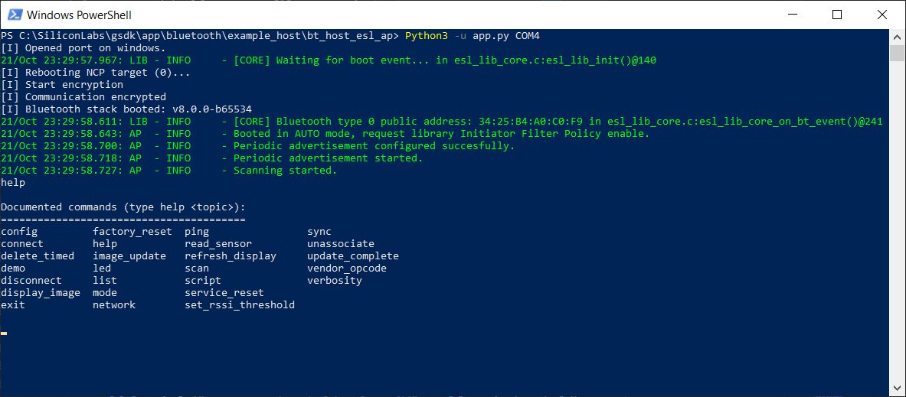

#### mode
    Changes ESL Access Point operation mode.

Usage: `mode [-h] [{auto,manual}] [{single,list}]`

Positional arguments:
- `{auto,manual}`:   Toggle between automatic and manual mode of AP operation.
- `{single,list}`:   Toggle ESL library connection initiation behavior between single or list based.

_Note: To check current mode you can issue the command without argument._
_Disclaimer: Please also note that manual mode gives you full control over the devices on your network, allowing you to easily violate the Profile rules (e.g. setting the same ESL ID and Group ID on two different devices at the same time), so use this option with caution!_

Examples:
- `mode manual`

  Change mode to manual mode, sets the most appropriate library connection initiation method (single) accordingly.

- `mode auto single`

  Change mode to auto mode, while overriding the best fitting library connection initiation method to single. (Auto mode would prefer the list-based method if the optional second argument were omitted.)
- `mode`

  Ask current mode.

#### network
    Execute commands related to the network control.

  Usage: `network [-h] [--save [FILE]] [--load [FILE]] [--exclusive {no,yes}]`

  Options:
  - `--save [FILE], -s [FILE]`: Export the current network configuration (Bluetooth and ESL addresses, grouped) to a JSON formatted file. Use quotation marks if the path contains spaces.
  - `--load [FILE], -l [FILE]`: Import network configuration in JSON format (e.g. from a previously exported backup)
  - `--exclusive {no,yes}, -e {no,yes}`: Exclusive mode allows only preconfigured devices to synchronize (otherwise any ESL detected within RSSI limits)

_Notes:_
- _To check current network exclusivity mode, issue the command without arguments._
- _If both `--save` and `--load` requests are issued in the same command, the file export operation is done first, regardless of the sequence of arguments._

_Disclaimer: Please also note that importing a pre-defined network configuration from a JSON file gives you full control over the devices on your network in auto (aka ESL profile) mode, potentially overriding your previous / running network configurations, so use this option with caution!_

#### set\_rssi\_threshold
    Set RSSI filter threshold value. Below this value the device will be ignored during scanning.

Usage: `set_rssi_threshold [-h] rssi`

Positional argument:
- `rssi`: RSSI value.

_Note: Negative values are accepted, only!_

#### scan
    Start or stop scanning for advertising ESL devices.

Usage: `scan [-h] [--active, -a] [{start,stop}]`

Positional arguments:
- `{start, stop}`: Start/stop scanning for advertising ESL devices.

Option:
- `[--active]`:    Start active scan instead of default passive.

_Notes:_
- _Passive type scanning starts automatically when AP script is started in auto mode to provide continuous Tag discovery._
- _You can obtain the current status of the scanning by omitting the choice._

#### list
    List details about known devices by state.

Usage: `list [-h] [--verbose | --number] [--group_id <u7>] state [state ...]`

Positional arguments:
- `state`:                   {advertising, a, blocked, b, connected, c, initiating, i, synchronized, s, unsynchronized, u}
    - `[advertising, a]`:    List devices that are advertising ESL Service UUID.
    - `[blocked, b]`:        List blocked devices, see reasoning by adding `-v`.
    - `[connected, c]`:      List connected ESL information.
    - `[initiating, i]`:     List devices that are in connection initiation queue
    - `[synchronized, s]`:   List synchronized ESL information.
    - `[unsynchronized, u]`: List unsynchronized ESL information.

Options:
- `[--verbose, -v]`:         List more detailed information, mutually exclusive with `number` param. (optional).
- `[--number, -n]`:          Show only the number of devices in given state(s), mutually exclusive with `verbose` param. (optional).
- `[--group_id, -g <u7>]`:   ESL group ID filter (optional - default: all group).

Examples:
- `list synchronized -v`
- `list b a s i c`
- `list c a -n`

_Note: To reset the content of advertising and blocked lists you may want to issue a `scan start` command at any time._

#### sync
     Start / stop sending synchronization packets.

Usage:
  - `sync [-h] [--millis] [--advertise] [--in_max <int>] [--in_min <int>] [--se_count <int>] [--se_interval <int>] [--rs_delay <int>] [--rs_spacing <int>] [--rs_count <int>] [{start,stop,config}]`

Positional arguments:
- `{start,stop,config}`:              Start/Stop sending periodic synchronization packets or set PAWR parameters.

Options:
- `[--millis, -ms]`:                  Specify timing parameters in milliseconds.
- `--advertise, -a`:                  Enable extended advertising of PAwR train parameters for sync scanners*
- `[--in_max <int>, -max <int>]`:     Maximum periodic advertising interval in ms if -ms was given, otherwise in units of 1.25ms.
- `[--in_min <int>, -min <int>]`:     Minimum periodic advertising interval in ms if -ms was given, otherwise in units of 1.25ms.
- `[--se_count <int>, -sc <int>]`:    Number of subevents.
- `[--se_interval <int>, -si <int>]`: Subevent interval in ms if -ms was given, otherwise in units of 1.25ms.
- `[--rs_delay <int>, -rd <int>]`:    Response slot delay in ms if -ms was given, otherwise in units of 1.25ms.
- `[--rs_spacing <int>, -rs <int>]`:  Response slot spacing in ms if -ms was given, otherwise in units of 0.125ms.
- `[--rs_count <int>, -rc <int>]`:    Response slot count.

_Notes:_
- _After changing the PAwR sync configuration by `sync config` the sync train needs to be restarted by issuing a simple `sync start` command. The new config will take place until exiting the script._
- _Issuing `sync config` without any further parameter will display the current sync train configuration._
- _Using the optional `-ms` argument with the 'config' subcommand allows you to specify timing parameters in milliseconds instead of their natural units, but this may introduce rounding errors. Please also note that with this option the fractional milliseconds can't be specified precisely._
- _You can ask for the current status of the PAwR train by omitting the choice._
- _If a configuration attempt is made with an implausible parameter set, the previous working configuration is restored._

_\*Disclaimer:_
- _Extended advertisement of PAwR train parameters, when initiated with a `--advertise` request, does not start immediately when the sync signal is activated. Instead, the parameter advertisement is started only after the first PAST procedure is SUCCESSFULLY initiated on a connected device. This delay ensures that if the PAwR train is intentionally restarted, the ESLs will enter the Unsynchronized state and advertise according to the ESL specification, rather than just silently resynchronizing to another sync signal._

Examples:
- `sync start`

  Start sync with current PAwR parameters.
- `sync config -min 1500 -max 2500 -sc 3 -si 250 -rd 170 -rs 3 -rc 24`

  Configure PAwR train with given parameters - please note that the new config will be active after sync is re-started.
- `sync config`

  Get current config and doesn't change any sync status. That is, the PAwR train will continue running if it was already enabled.
- `sync start [-min 2000] -max 2100`

  Start sync with current PAwR parameters, but temporarily override the interval to a value between 2.0 and 2.1 seconds. Please note that this short form is only for convenience to quickly change the interval, but its effect on the current configuration is not permanent and the value is always interpreted in milliseconds - so it may also introduce rounding errors.

#### demo
     Control the built-in advertising feature of the ESL NCP AP target for the ESL demo in the Simplicity Connect mobile application.

Usage:  `demo [-h] [{on,off}]`

Positional arguments:
- `{on,off}`: Turn AP advertising on or off for ESL Demo in Simplicity Connect mobile app.

_Note: You can obtain the current status of the demo mode by omitting the choice._

#### script
      Record commands to an output file, execute them from an input file, or wait (optionally for events with address filtering).

Usage: `script [-h] {record,run,wait} ...`

Subcommands:
- `record <filename>`: Record commands to an output file.

    Positional argument:
    - `filename`: Filename to write AP commands to. After issuing this command, all subsequent commands will be executed and recorded into the given file until recording is stopped. Note: `stop` is reserved and cannot be used as a filename (see note below).

- `run <filename>`: Run commands from an input file.

    Positional argument:
    - `filename`: Filename to read AP commands from.
  
- `wait [--group_id <u7>] seconds [event] [address]`: Wait before running the next command.

    Positional arguments:
    - `seconds`: Seconds to wait.
    - `[event]`: Event name (e.g. `connection_opened`, `ESL_LIB_EVT_TAG_FOUND`).
    - `[address]`: ESL ID (0-254), BLE address, or `all`.

    Option:
    - `[--group_id, -g <u7>]`: ESL group ID (optional, default 0 if an address is given, None otherwise); with address `all`, wait for first event from this group.

Option:
- `-h, --help`: Show this help message  - use `<subcommand> -h` for more details.

_Notes:_
- _With `script record`, using `stop` as the filename stops an ongoing recording and closes the file._
- _Scripting is an experimental feature only - it also supports basic waiting with timeout and optional device filtering for events, but it lacks any configuration‑dependent and/or conditional execution capabilities._
- _Recorded script files may contain script commands as well, even recursively. However, it is strongly advised to avoid it, as recursive execution cannot be interrupted and may lead to uncontrolled behavior._

Examples:
- `script record myscript.esl`

  Start recording to local file `myscript.esl`. Any subsequent commands entered at the CLI will be executed as usual and, in parallel, recorded to `myscript.esl`.
- `script record stop`

  Stop current recording (run this after you have manually executed the steps you want to record).
- `script run myscript.esl`

  Repeat steps (commands) that were previously recorded to local file `myscript.esl`.
- `script record test.script ; image_update 0 "image/banana.png" -l "hello;\n world!" ; ping 0 ; config -f -i1 ; script wait 2 ; display_image 1 0 0 ; script record stop`

  Advanced example to demonstrate complex scripting with command chaining at the same time. Please note that the command separator `;` needs spaces before and after for the chaining to work properly. The recorded script will contain one command per line as it was recorded without command chaining.
- `connect 0 ; script wait 5 connection_opened 0 -g0 ; image_update 0 *qrcode 0 ; script wait 10 image_transfer_finished ; disconnect`

  Example showing an end-to-end flow with command chaining: connect to ESL 0 (_in default group 0_), wait (_up to 5 seconds_) for the connection to be opened, update the image using the built-in QR code generator, wait (_up to 10 seconds_) for the image transfer to be finished (_This time there's no address filtering, so it accepts any `image_transfer_finished` event. Works as long as there's no other ongoing image transfer in parallel._), then disconnect. Please note that there's no error handling possible in these one-liners.

#### verbosity

     Set Access Point logging verbosity level at runtime

Usage:  `verbosity [-h] [{NOTSET,TRACE,DEBUG,INFO,WARNING,ERROR,CRITICAL}]`

Positional arguments:
- `{NOTSET,TRACE,DEBUG,INFO,WARNING,ERROR,CRITICAL}` Level to apply

_Notes:_
- _To check current verbosity level you can issue the command without argument._
- _TRACE can be used to display debugging messages not only for AP code, but also for the underlying ESL library._
- _NOTSET can be used to display debugging messages for all python modules that may utilize logging (including but not limited to ESL shared library)._

#### exit
    Terminate AP application.

Usage: `exit`
