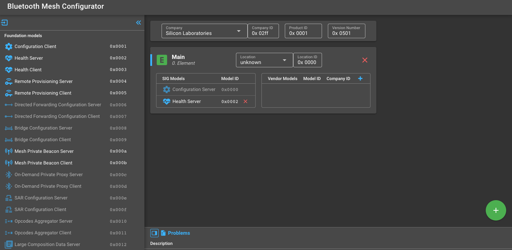
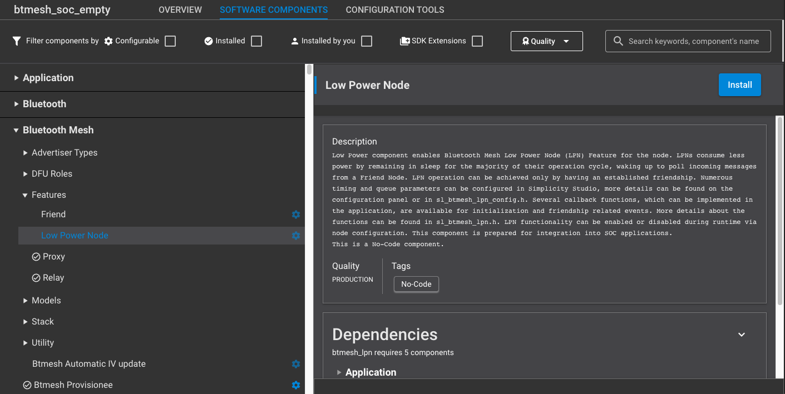
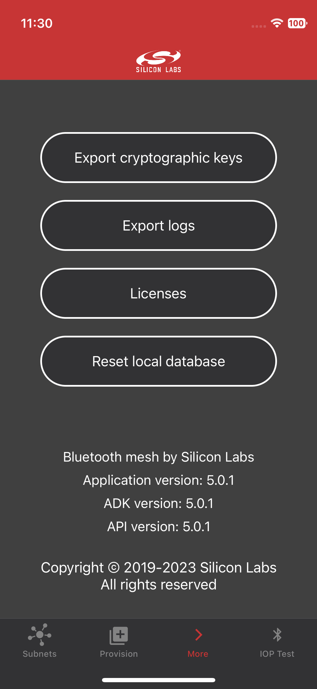
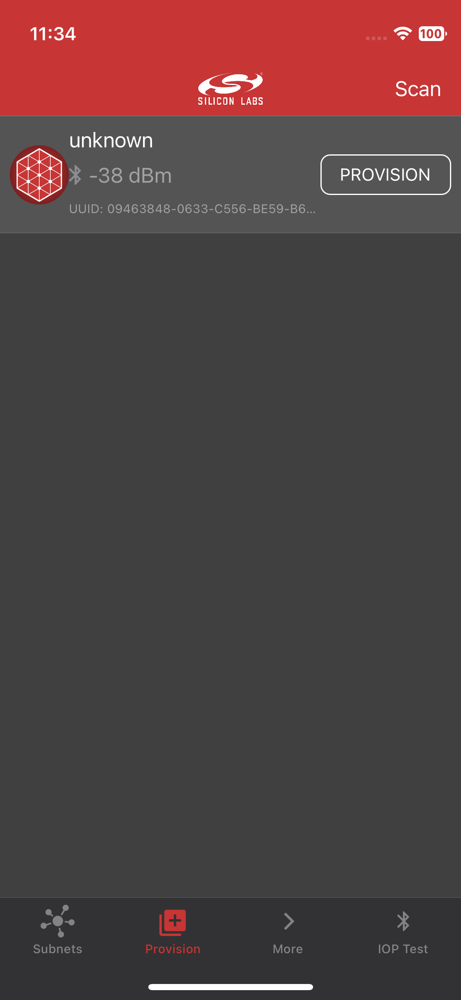
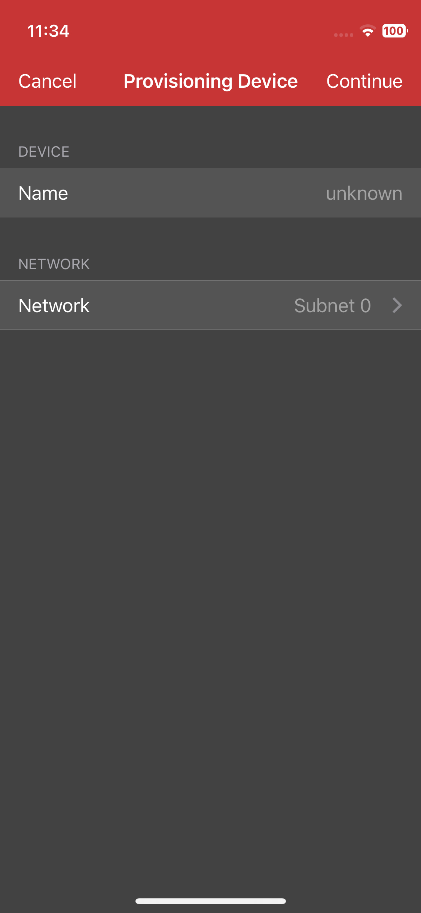

# Bluetooth Mesh - SoC Empty with Common Manufacturing Token Support

This example demonstrates the bare minimum needed for a Bluetooth mesh C application that supports Common Manufacturing Tokens. The application starts Unprovisioned Device Beaconing based on the token data present on the device. The token can be used to set the device's UUID and/or OOB configuration.

## Getting Started

To learn Bluetooth mesh technology basics, see [Bluetooth Mesh Network - An Introduction for Developers](https://www.bluetooth.com/wp-content/uploads/2019/03/Mesh-Technology-Overview.pdf).

To get started with Silicon Labs Bluetooth Mesh and Simplicity Studio, see [QSG176: Bluetooth Mesh SDK v2.x Quick Start Guide](https://www.silabs.com/documents/public/quick-start-guides/qsg176-bluetooth-mesh-sdk-v2x-quick-start-guide.pdf).

The term SoC stands for "System on Chip". In the SoC model the entire system (stack and application) resides on a single chip, whereas in the NCP model the stack processing is done in a separate coprocessor that interacts with the application’s microcontroller through an external serial interface.

This example is an (almost) empty project that has only the bare minimum with Proxy and Relay features included to make a working Bluetooth Mesh application.

To add or remove features from the example, follow this process:

- Add model and feature components to your project
- Optionally configure your Mesh node through the "Bluetooth Mesh Configurator". It is configured to have only one element supporting a minimal set of models.

## Project Architecture

With the introduction of `sl_main`, a new architecture has been implemented to streamline application development. This architecture introduces several key functions that provide a structured and consistent approach to initialization and execution. Below is an overview of these functions and their roles:

- `app_init_early`: Invoked after system initialization. This function is ideal for early setup tasks that should take place before the SiSDK modules are initialized.
- `app_permanent_memory_alloc`: Called after system memory allocations and `app_init_early`. Permanent memory allocations should be placed here.
- `app_init`: Executed after all stacks and components are initialized. This function serves as the main initialization point for the application.
- `app_proceed`: Signals the application to proceed with the next iteration of the main loop.
- `app_process_action`: Represents the main loop of the application. It is executed once for every call to `app_proceed`.

### Bare-Metal Applications
In bare-metal applications, the application functions (`app_init_early`, `app_permanent_memory_alloc`, etc.) are present to ensure the same interface with the RTOS applications.

To learn more about programming an SoC application, see [UG472: Silicon Labs Bluetooth ® Mesh Configurator User's guide for SDK v2.x](https://www.silabs.com/documents/public/user-guides/ug472-bluetooth-mesh-v2x-node-configuration-users-guide.pdf).

- Some components are configurable, and can be customized using the Component Editor

- Respond to the events raised by the Bluetooth stack
- Implement additional application logic

[UG295: Silicon Labs Bluetooth ® Mesh C Application Developer's Guide for SDK v2.x](https://www.silabs.com/documents/public/user-guides/ug295-bluetooth-mesh-dev-guide.pdf) gives code-level information on the stack and the common pitfalls to avoid.

## Responding to Bluetooth Events

Just like in the Bluetooth Low Energy SDK, a Mesh application is event-driven. The Bluetooth Mesh stack generates events when a remote device connects or disconnects, for example, or when it publishes a message. While it is not necessary to react to all events, the ones requiring action should be handled by the application in the `sl_btmesh_on_event()` function. The prototype of this function is implemented in *app.c*. To handle more events, the switch-case statement of this function is to be extended. For the list of Bluetooth Mesh events, see the HTML documentation present in the Simplicity Studio installation directory:

* <Simplicity-Studio-installation-directory\offline\com.silabs.sdk.stack.super_4.0.1\app\btmesh\documentation<SDK-installation-location>/documentation/API_BLUETOOTH_MESH_HTML

## Implementing Application Logic

Additional application logic has to be implemented in the 'app_init()' and 'app_process_action()' functions. Find the definitions of these functions in *app.c*. The 'app_init()' function is called once when the device is booted, and 'app_process_action()' is called repeatedly in a while(1) loop. For example, you can poll peripherals in this function.

## Features Already Added to Bluetooth Mesh - SoC Empty with Common Manufacturing Token Support Application

The **Bluetooth Mesh - SoC Empty with Common Manufacturing Token support** application is ***almost*** empty. It implements a basic application to demonstrate how to use mesh manufacturing tokens to set device UUID and/or OOB capabilities.

## Testing the Bluetooth Mesh - SoC Empty with Common Manufacturing Token Support Application

As described above, an empty example does nothing except broadcast unprovisioned beacons with OOB configured based on token data. To make this example work, multiple steps are needed:

1. Create an ECC private-public key pair. Skip this step if you already have keys you wish to use. Install the Python module cryptography as follows:
    - `pip3 install cryptography`

    Once the module has been installed, you can use helper Python scripts to create cryptography keys, the mesh token, and to upload this data to the device:
    - `cd {Example directory}\scripts`
    - `python deploy_token.py token_data.json --generate-keypair`
    This script generates the private-public keypair `keys/ec_private.pem` and `keys/ecc_public.der` based on `token_data.json`. After that it creates the binary token data under `mesh_token_data` and finally deploys the token to the device via `commander tokens write`.

    If a key is already present:
    - `python deploy_token.py token_data.json --private-key keys/ecc_private.pem`
    can be used.

    Signing the token is optional. If no private key is provided to the script, the signature field in the token will be filled with padding bytes. The example application checks this and skips signature verification if needed.

    If a token is already present:
    - `python deploy_token.py mesh_token_data`
    will automatically detect that the provided file is the binary token data, will skip generation steps and only flash it to the device.

    The full capabilities of the script is shown by `python3 deploy_token.py -h`.

2. Once the manufacturing data is present on the device, or the public key is known, run the following script to automatically update `btmesh_soc_empty_cmt.slcp`:
   - `python update_public_key.py keys/ecc_public.der`
   This script updates the `SL_BTMESH_CMT_TOKEN_PUBLIC_KEY` configuration to use the exported public key.

3. Now generate the project with the updated .slcp.

4. Build and flash the **Bluetooth Mesh - SoC Empty with Common Manufacturing Token Support** example to your device. Do not erase the device beforehand, just overwrite the existing content. The flashing can be done, for example, using the Simplicity Studio internal **Flash Programmer** or external **Simplicity Commander** tools.

   If the device was erased, the token can be reflashed by
   - `python deploy_token.py mesh_token_data`.
   This will not overwrite existing firmware, only the token region.

4. Download the Silicon Labs **Bluetooth Mesh** smartphone application available on [iOS](https://apps.apple.com/us/app/bluetooth-mesh-by-silicon-labs/id1411352948) and [Android](https://play.google.com/store/apps/details?id=com.siliconlabs.bluetoothmesh). Make sure to reset the local database by pressing the "Reset local database" button in the menu "More".

5. Open the app, choose the Provision Browser, and tap **Scan**.

6. Now you should find your device advertising. Tap **PROVISION**.

## Troubleshooting

Before programming the radio board mounted on the mainboard, make sure the power supply switch the AEM position (right side) as shown below.

## Resources

[Bluetooth Documentation](https://docs.silabs.com/bluetooth/latest/)

[Bluetooth Mesh Network - An Introduction for Developers](https://www.bluetooth.com/wp-content/uploads/2019/03/Mesh-Technology-Overview.pdf)

[QSG176: Bluetooth Mesh SDK v2.x Quick Start Guide](https://www.silabs.com/documents/public/quick-start-guides/qsg176-bluetooth-mesh-sdk-v2x-quick-start-guide.pdf)

[AN1315: Bluetooth Mesh Device Power Consumption Measurements](https://www.silabs.com/documents/public/application-notes/an1315-bluetooth-mesh-power-consumption-measurements.pdf)

[AN1316: Bluetooth Mesh Parameter Tuning for Network Optimization](https://www.silabs.com/documents/public/application-notes/an1316-bluetooth-mesh-network-optimization.pdf)

[AN1317: Using Network Analyzer with Bluetooth Low Energy ® and Mesh](https://www.silabs.com/documents/public/application-notes/an1317-network-analyzer-with-bluetooth-mesh-le.pdf)

[AN1318: IV Update in a Bluetooth Mesh Network](https://www.silabs.com/documents/public/application-notes/an1318-bluetooth-mesh-iv-update.pdf)

[UG295: Silicon Labs Bluetooth Mesh C Application Developer's Guide for SDK v2.x](https://www.silabs.com/documents/public/user-guides/ug295-bluetooth-mesh-dev-guide.pdf)

[UG472: Silicon Labs Bluetooth ® C Application Developer's Guide for SDK v3.x](https://www.silabs.com/documents/public/user-guides/ug434-bluetooth-c-soc-dev-guide-sdk-v3x.pdf)

[Bluetooth Training](https://www.silabs.com/support/training/bluetooth)

## Report Bugs & Get Support

You are always encouraged and welcome to report any issues you found to us via [Silicon Labs Community](https://www.silabs.com/community).
