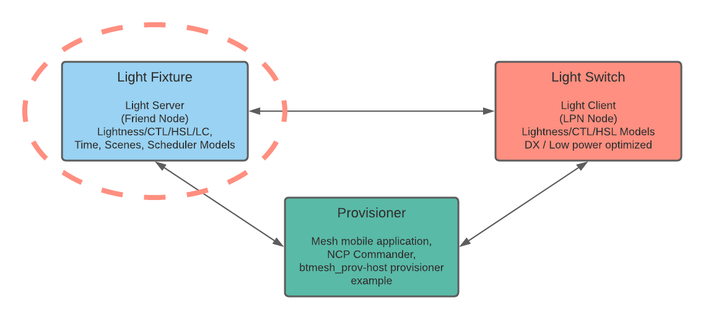
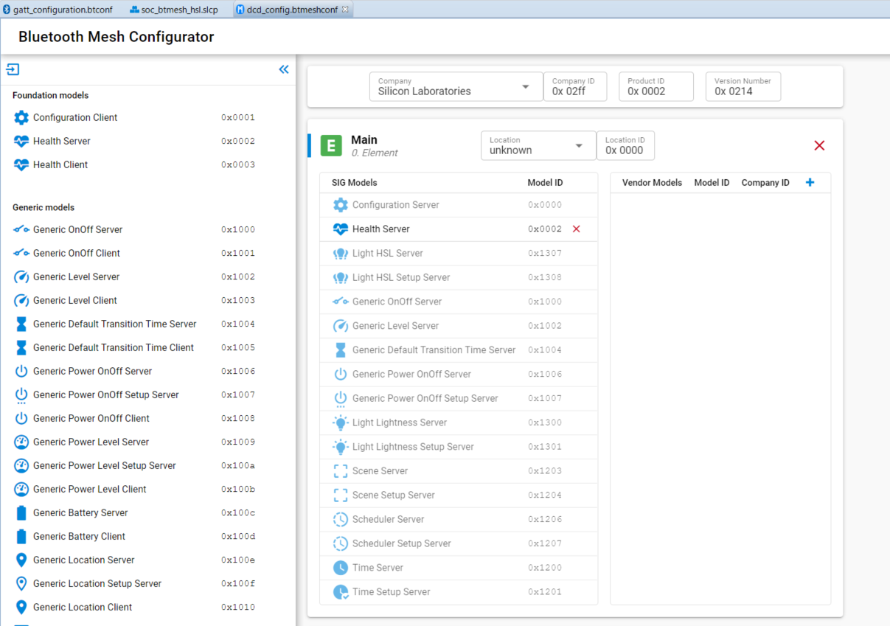
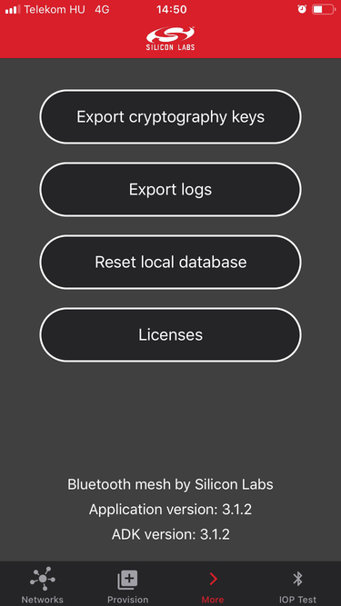
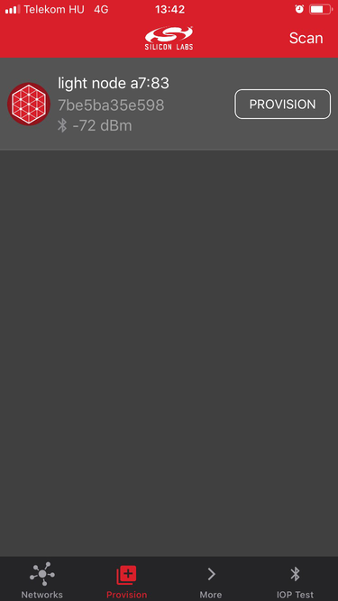
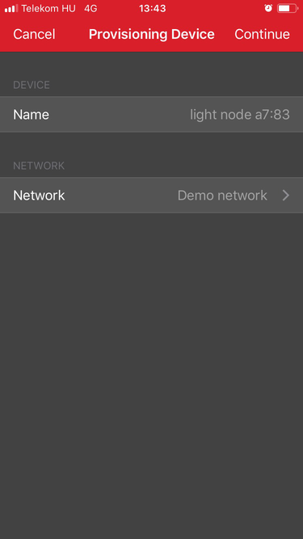
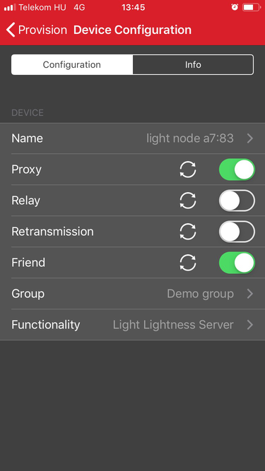
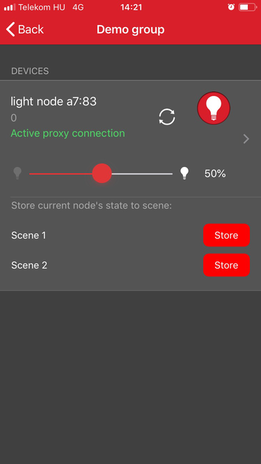

# Bluetooth Mesh - SoC Light HSL (Hue, Saturation, Lightness)

The **Bluetooth Mesh - SoC Light HSL** example is a working example application that you can use as a template for Bluetooth Mesh HSL Light applications.

The example is an out-of-the-box Software Demo where the LEDs of the device can be controlled by button presses on another device (for example **Bluetooth Mesh - SoC Switch CTL**). The LEDs can be switched on and off, and their **lighting intensity** can also be set. **Hue** and **saturation** (shown only on the LCD or in UART logs, depending on the mainboard) can be set by the Light HSL Client model. The example also tries to establish friendship as a Friend node and prints its status to the LCD or UART. The example is based on the Bluetooth Mesh Generic On/Off Model, the Light Lightness Model, the Light HSL Server Model and the Light LC Server Model. This example requires one of the Internal Storage Bootloader (single image) variants, depending on device memory.

*Note: Currently Silicon Labs does not have an SoC HSL Client example app which could demonstrate setting the Hue and Saturation of the light source, but **NCP Commander** can be used for testing by using the bound states between the HSL model and Generic Client Models.*

*Note - this example is not compatible with the Basic Lightness Controller NLC Profile, for a lighting example which is compatible with the Networked Lighting Control (NLC) Profiles please use the NLC Basic Lightness Controller example.*

## Getting Started

To learn Bluetooth mesh technology basics, see [Bluetooth Mesh Network - An Introduction for Developers](https://www.bluetooth.com/wp-content/uploads/2019/03/Mesh-Technology-Overview.pdf).

To get started with Bluetooth Mesh and Simplicity Studio, see [QSG176: Bluetooth Mesh SDK v2.x Quick Start Guide](https://www.silabs.com/documents/public/quick-start-guides/qsg176-bluetooth-mesh-sdk-v2x-quick-start-guide.pdf).

The term SoC stands for "System on Chip", meaning that this is a standalone application that runs on the EFR32/BGM and does not require any external MCU or other active components to operate.

This is an example of a Bluetooth Mesh HSL light application. It demonstrates how to control a light source, an LED mounted on a mainboard and a radio board or similar hardware, connected to a Bluetooth Mesh network. The light source lightness can be controlled with a light client, such as another radio board running the **Bluetooth Mesh - SoC Switch** application, or with **Bluetooth Mesh** smartphone application.

*Note: Currently neither **Bluetooth Mesh - SoC Switch** nor the mobile application supports HSL Client. All the other features work.*

While the example is optimized for **Light HSL Server** functionality, it can be controlled in many ways due to its bound models:

- **Generic OnOff Server** model can turn the light on and off
- **Generic Level Server** model can control the light brightness
- **Light Lightness Server** model can control the light Lightness
- **Light HSL Server** model can control light Lightness, (Hue and Saturation only virtually, can be seen only in the LCD and logs)

For more information on the HSL light model, see the following [Wikipedia link](https://en.wikipedia.org/wiki/HSL_and_HSV#HSL_to_RGB_alternative).

To add or remove features from the example, follow this process:

- Add model and feature components to your project
- Optionally configure the Mesh node through the "Bluetooth Mesh Configurator"

To learn more about programming an SoC application, see [UG472: Silicon Labs Bluetooth ® Mesh Configurator User's guide for SDK v2.x](https://www.silabs.com/documents/public/user-guides/ug472-bluetooth-mesh-v2x-node-configuration-users-guide.pdf).

- Some components are configurable, and can be customized using the Component Editor

- Respond to the events raised by the Bluetooth stack
- Implement additional application logic

[UG295: Silicon Labs Bluetooth ® Mesh C Application Developer's Guide for SDK v2.x](https://www.silabs.com/documents/public/user-guides/ug295-bluetooth-mesh-dev-guide.pdf) gives code-level information on the stack and the common pitfalls to avoid.

## Testing the Bluetooth Mesh - SoC Light HSL Application

To test the application, do the following:

1. Build and flash the **Bluetooth Mesh - SoC Light HSL** example to your device.
2. Reset the device by pressing and releasing the reset button on the mainboard while pressing BTN0. The message "Factory reset" should appear on the LCD.
3. Provision the device in one of three ways:

   - NCP Host provisioner examples, see for example an SDK folder `example_host/btmesh_host_provisioner` or [github](https://github.com/SiliconLabs/bluetooth_mesh_stack_features/tree/master/provisioning)

   - NCP Commander with NCP target device, see [Bluetooth NCP Commander guide](https://docs.silabs.com/simplicity-studio-5-users-guide/latest/ss-5-users-guide-tools-bluetooth-ncp-commander) or [AN1259: Using the v3.x Silicon Labs Bluetooth Stack in Network Co-Processor Mode](https://www.silabs.com/documents/public/application-notes/an1259-bt-ncp-mode-sdk-v3x.pdf)

   - For Mobile Phone use, see the [QSG176: Bluetooth Mesh SDK v2.x Quick-Start Guide](https://www.silabs.com/documents/public/quick-start-guides/qsg176-bluetooth-mesh-sdk-v2x-quick-start-guide.pdf) for more information how to download and use the Silicon Labs Bluetooth Mesh application.

   Mobile Phone provisioning is illustrated in the following figure.

4. Open the app, choose the Provision Browser, and tap **Scan**.

5. Now you should find your device advertising as "light node" (iOS) or "Unknown" (Android). Tap **PROVISION**.

6. Configure the device as **Light Lightness Server** and select the correct group to which the messages will be published (Demo group). If you want to test the Bluetooth Mesh Generic OnOff Model, the Scene Model or some other Mesh Model, then select the respective client instead. You can use only one at a time in our mobile application. The mobile application does not support Light HSL Model yet, therefore use the Light Lightness Model.

7. Use the slider to set the lightness of the mainboard + radio board LED.

8. The next step is to add a switch or several switches into your network, if it has not already been done. This is required to fully test the whole system, for example the friendship and other features. You can then control the light example by pressing the buttons in the **Bluetooth Mesh - SoC Switch** and **Bluetooth Mesh - SoC Switch Low Power** examples. Read the applicable example project documentation to learn more.

For more information on the example, see [AN1299: Understanding the Silicon Labs Bluetooth Mesh SDK v2.x Lighting Demonstration](https://www.silabs.com/documents/public/application-notes/an1299-understanding-bluetooth-mesh-lighting-demo-sdk-2x.pdf).

## Troubleshooting

Before programming the radio board mounted on the mainboard, make sure the power supply switch the AEM position (right side) as shown below.

## Resources

[Bluetooth Documentation](https://docs.silabs.com/bluetooth/latest/)

[Bluetooth Mesh Network - An Introduction for Developers](https://www.bluetooth.com/wp-content/uploads/2019/03/Mesh-Technology-Overview.pdf)

[QSG176: Bluetooth Mesh SDK v2.x Quick Start Guide](https://www.silabs.com/documents/public/quick-start-guides/qsg176-bluetooth-mesh-sdk-v2x-quick-start-guide.pdf)

[AN1315: Bluetooth Mesh Device Power Consumption Measurements](https://www.silabs.com/documents/public/application-notes/an1315-bluetooth-mesh-power-consumption-measurements.pdf)

[AN1316: Bluetooth Mesh Parameter Tuning for Network Optimization](https://www.silabs.com/documents/public/application-notes/an1316-bluetooth-mesh-network-optimization.pdf)

[AN1317: Using Network Analyzer with Bluetooth Low Energy ® and Mesh](https://www.silabs.com/documents/public/application-notes/an1317-network-analyzer-with-bluetooth-mesh-le.pdf)

[AN1318: IV Update in a Bluetooth Mesh Network](https://www.silabs.com/documents/public/application-notes/an1318-bluetooth-mesh-iv-update.pdf)

[AN1299: Understanding the Silicon Labs Bluetooth Mesh SDK v2.x Lighting Demonstration](https://www.silabs.com/documents/public/application-notes/an1299-understanding-bluetooth-mesh-lighting-demo-sdk-2x.pdf)

[UG295: Silicon Labs Bluetooth Mesh C Application Developer's Guide for SDK v2.x](https://www.silabs.com/documents/public/user-guides/ug295-bluetooth-mesh-dev-guide.pdf)

[UG472: Silicon Labs Bluetooth ® C Application Developer's Guide for SDK v3.x](https://www.silabs.com/documents/public/user-guides/ug434-bluetooth-c-soc-dev-guide-sdk-v3x.pdf)

[Wikipedia link](https://en.wikipedia.org/wiki/HSL_and_HSV#HSL_to_RGB_alternative)

[Bluetooth Training](https://www.silabs.com/support/training/bluetooth)

## Report Bugs & Get Support

You are always encouraged and welcome to report any issues you found to us via [Silicon Labs Community](https://www.silabs.com/community).
