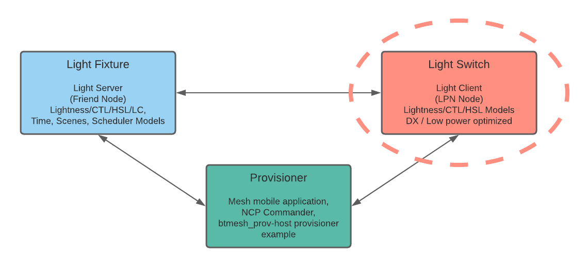
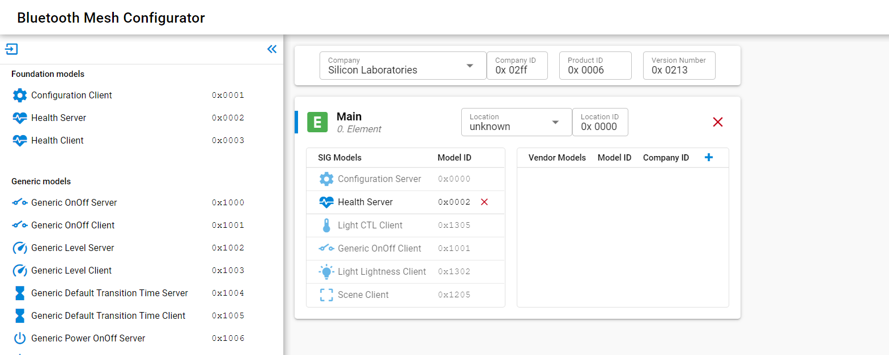
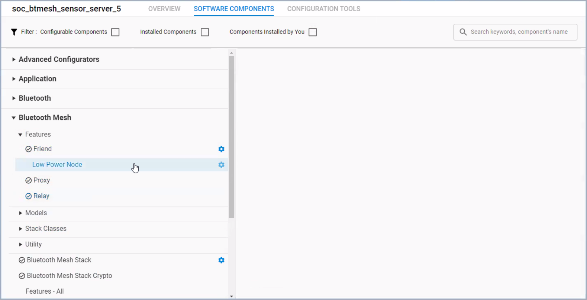
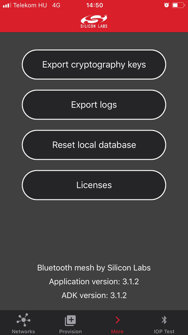
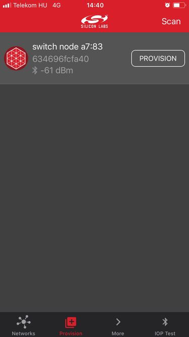
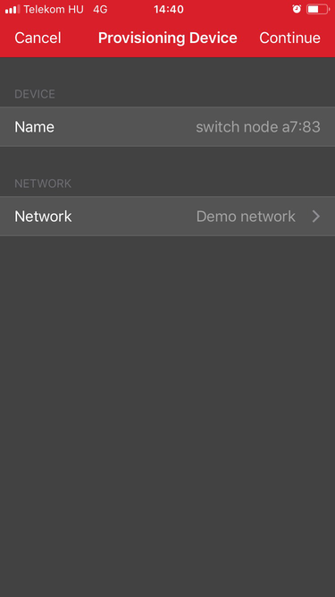
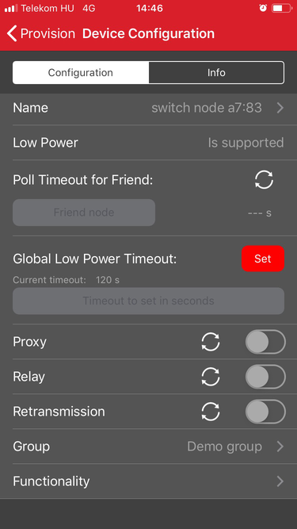
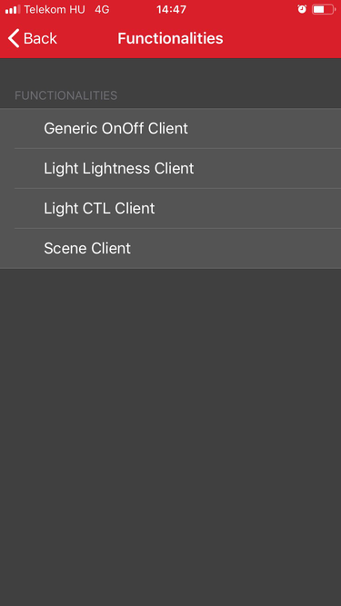

# Bluetooth Mesh - SoC Switch CTL Low Power

The **Bluetooth Mesh - SoC Switch CTL Low Power** example is a working example application that you can use as a template for Bluetooth Mesh Switch Low Power applications.

The example is an out-of-the-box Software Demo optimized for low current consumption where the device acts as a switch. It has disabled CLI, logging, and LCD. Button presses on the mainboard can control the state, lightness, and color temperature of the LEDs as well as scenes on a remote device (for example **Bluetooth Mesh - SoC Light CTL**). The example also acts as an Low Power Node and tries to establish friendship. The example is based on the Bluetooth Mesh Generic On/Off Client Model, the Light Lightness Client Model, the Light CTL Client Model, and the Scene Client Model. This example requires one of the Internal Storage Bootloader (single image) variants, depending on device memory.

In typical cases use the **Bluetooth Mesh - SoC Switch CTL** example, as it is easier to get feedback about the state and operations. But if you want to have the optimal power consumption, use the **Bluetooth Mesh - SoC Switch CTL Low Power** example, which does not have LCD, CLI or logging. Use that especially for the power consumption measurements.

The switch requires a friend node to function properly.

## Getting Started

To learn Bluetooth mesh technology basics, see [Bluetooth Mesh Network - An Introduction for Developers](https://www.bluetooth.com/wp-content/uploads/2019/03/Mesh-Technology-Overview.pdf).

To get started with Bluetooth Mesh and Simplicity Studio, see [QSG176: Bluetooth Mesh SDK v2.x Quick Start Guide](https://www.silabs.com/documents/public/quick-start-guides/qsg176-bluetooth-mesh-sdk-v2x-quick-start-guide.pdf).

The term SoC stands for "System on Chip", meaning that this is a standalone application that runs on the EFR32/BGM and does not require any external MCU or other active components to operate.

This is an example of a Low Power Node-enabled energy efficient Bluetooth Mesh switch application. The example removes LCD display and logging features. For more information on how to measure power consumption, see [AN1315: Bluetooth Mesh Device Power Consumption Measurements](https://www.silabs.com/documents/public/application-notes/an1315-bluetooth-mesh-power-consumption-measurements.pdf). Once the node is provisioned and a light server (light node) subscribes to the client, the two buttons of the mainboard are used to publish the messages that will change the light lightness on the server.

We can use the buttons many other ways using the different models of this example:

- **Generic OnOff Client** model can turn the light on and off or toggle
- **Generic Level Client** model can control the light brightness
- **Light Lightness Client** model can control the light Lightness
- **Light CTL Client** model can control light Lightness and Color Temperature (Delta UV only virtually)
- **Scene Server** model allows customer to recall the light settings

A friendship with a light node has to be established for the switch node to start the sleep/poll cycles.

To add or remove features from the example, follow this process:

- Add model and feature components to your project
- Optionally configure the Mesh node through the "Bluetooth Mesh Configurator"

## Project Architecture

With the introduction of `sl_main`, a new architecture has been implemented to streamline application development. This architecture introduces several key functions that provide a structured and consistent approach to initialization and execution. Below is an overview of these functions and their roles:

- `app_init_early`: Invoked after system initialization. This function is ideal for early setup tasks that should take place before the SiSDK modules are initialized.
- `app_permanent_memory_alloc`: Called after system memory allocations and `app_init_early`. Permanent memory allocations should be placed here.
- `app_init`: Executed after all stacks and components are initialized. This function serves as the main initialization point for the application.
- `app_init_runtime`: A sub-function of `app_init`, specifically responsible for initializing the Bluetooth Mesh application.
- `app_proceed`: Signals the application to proceed with the next iteration of the main loop.
- `app_process_action`: Represents the main loop of the application. It is executed once for every call to `app_proceed`.

### Bare-Metal Applications
In bare-metal applications, the application functions (`app_init_early`, `app_permanent_memory_alloc`, etc.) are present to ensure the same interface with the RTOS applications.

To learn more about programming an SoC application, see [UG472: Silicon Labs Bluetooth ® Mesh Configurator User's guide for SDK v2.x](https://www.silabs.com/documents/public/user-guides/ug472-bluetooth-mesh-v2x-node-configuration-users-guide.pdf).

- Some components are configurable, and can be customized using the Component Editor

- Respond to the events raised by the Bluetooth stack
- Implement additional application logic

[UG295: Silicon Labs Bluetooth Mesh C Application Developer's Guide for SDK v2.x](https://www.silabs.com/documents/public/user-guides/ug295-bluetooth-mesh-dev-guide.pdf) gives code-level information on the stack and the common pitfalls to avoid.

## Testing the Bluetooth Mesh - SoC Switch CTL Low Power Application

To test the application, do the following:

1. Build and flash the **Bluetooth Mesh - SoC Switch CTL Low Power** example to the device.
2. Reset the device by pressing and releasing the reset button on the mainboard while pressing BTN0.
3. Provision the device in one of three ways:

   - NCP Host provisioner examples, see for example an SDK folder `example_host/btmesh_host_provisioner` or [github](https://github.com/SiliconLabs/bluetooth_mesh_stack_features/tree/master/provisioning)

   - NCP Commander with NCP target device, see [Bluetooth NCP Commander guide](https://docs.silabs.com/simplicity-studio-5-users-guide/latest/ss-5-users-guide-tools-bluetooth-ncp-commander) or [AN1259: Using the v3.x Silicon Labs Bluetooth Stack in Network Co-Processor Mode](https://www.silabs.com/documents/public/application-notes/an1259-bt-ncp-mode-sdk-v3x.pdf)

   - For Mobile Phone use, see the [QSG176: Bluetooth Mesh SDK v2.x Quick-Start Guide](https://www.silabs.com/documents/public/quick-start-guides/qsg176-bluetooth-mesh-sdk-v2x-quick-start-guide.pdf) for more information how to download and use the Silicon Labs Bluetooth Mesh application.

   Mobile Phone provisioning is illustrated in the following figure.

4. Open the app, choose the Provision Browser, and tap **Scan**.

5. Tap **PROVISION** and continue provisioning.

6. Select the right "Group" and then tap the "Functionality" menu.

7. Configure the device as **Light CTL Client**. If you want to test the Bluetooth Mesh Generic OnOff Model, the Light Lightness Model, the Scene Model or some other Mesh Model, then select the respective client instead. You can use only one at a time in our mobile application. With the **SoC Light HSL** demo use the Light Lightness Client.

8. The next step is to add a light or several lights into your network, if it has not already been done. This is required to fully test the whole system, for example the friendship and other features. You can then control the **Bluetooth Mesh - SoC Light** and **Bluetooth Mesh - SoC HSL Light** examples by pressing the buttons on the device. Read the applicable example project documentation to learn more.
For more information on the example, see [AN1299: Understanding the Silicon Labs Bluetooth Mesh SDK v2.x Lighting Demonstration](https://www.silabs.com/documents/public/application-notes/an1299-understanding-bluetooth-mesh-lighting-demo-sdk-2x.pdf).

The button presses in this example:

- Short press controls the Lightness (**Light Lightness Client** and **Light CTL Client** models)
- Medium press controls the Color Temperature (**Light CTL Client** model)
- Long press controls the light On/Off (all Lighting models)
- Very long press recalls the scenes (only when **Scene Server** model is configured)

## Troubleshooting

Before programming the radio board mounted on the mainboard, make sure the power supply switch the AEM position (right side) as shown below.

## Resources

[Bluetooth Documentation](https://docs.silabs.com/bluetooth/latest/)

[Bluetooth Mesh Network - An Introduction for Developers](https://www.bluetooth.com/wp-content/uploads/2019/03/Mesh-Technology-Overview.pdf)

[QSG176: Bluetooth Mesh SDK v2.x Quick Start Guide](https://www.silabs.com/documents/public/quick-start-guides/qsg176-bluetooth-mesh-sdk-v2x-quick-start-guide.pdf)

[AN1315: Bluetooth Mesh Device Power Consumption Measurements](https://www.silabs.com/documents/public/application-notes/an1315-bluetooth-mesh-power-consumption-measurements.pdf)

[AN1316: Bluetooth Mesh Parameter Tuning for Network Optimization](https://www.silabs.com/documents/public/application-notes/an1316-bluetooth-mesh-network-optimization.pdf)

[AN1317: Using Network Analyzer with Bluetooth Low Energy ® and Mesh](https://www.silabs.com/documents/public/application-notes/an1317-network-analyzer-with-bluetooth-mesh-le.pdf)

[AN1318: IV Update in a Bluetooth Mesh Network](https://www.silabs.com/documents/public/application-notes/an1318-bluetooth-mesh-iv-update.pdf)

[AN1299: Understanding the Silicon Labs Bluetooth Mesh SDK v2.x Lighting Demonstration](https://www.silabs.com/documents/public/application-notes/an1299-understanding-bluetooth-mesh-lighting-demo-sdk-2x.pdf)

[UG295: Silicon Labs Bluetooth Mesh C Application Developer's Guide for SDK v2.x](https://www.silabs.com/documents/public/user-guides/ug295-bluetooth-mesh-dev-guide.pdf)

[UG472: Silicon Labs Bluetooth ® C Application Developer's Guide for SDK v3.x](https://www.silabs.com/documents/public/user-guides/ug434-bluetooth-c-soc-dev-guide-sdk-v3x.pdf)

[Bluetooth Training](https://www.silabs.com/support/training/bluetooth)

## Report Bugs & Get Support

You are always encouraged and welcome to report any issues you found to us via [Silicon Labs Community](https://www.silabs.com/community).
