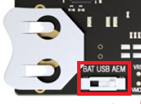

# Wi-SUN - SoC Border Router Empty

- [Introduction](#introduction)
- [Getting Started](#getting-started)
  - [Responding to Wi-SUN Events](#responding-to-wi-sun-events)
  - [Implementing Application Logic](#implementing-application-logic)
- [Troubleshooting](#troubleshooting)
- [Resources](#resources)
- [Report Bugs & Get Support](#report-bugs--get-support)

## Introduction

The Wi-SUN Border Router Empty sample application is a bare-bones application. This application can be used as a template to develop a Wi-SUN Border Router application.
The SoC term stands for "System on Chip", meaning that this is a standalone application running on the EFR32 without any external MCU required.
It provides an easy and quick way to evaluate the Silicon Labs Wi-SUN stack solution without deploying an expensive and cumbersome production-grade Wi-SUN Border Router.

## Getting Started

To get started with Wi-SUN and Simplicity Studio, see [Getting Started with Wi-SUN Application Development](https://docs.silabs.com/wisun/latest/wisun-getting-started-development).

As the name implies, the example is an empty template that only has the bare minimum to make a working Wi-SUN Border Router application. For this purpose, the example includes the Wi-SUN stack component and its dependencies (RTOS, cryptographic library...).

This skeleton can be extended with application logic.

The development of a Wi-SUN application consists of two main steps:

- Responding to the events raised by the Wi-SUN stack
- Implementing additional application logic

### Responding to Wi-SUN Events

A Wi-SUN application is event-driven. The Wi-SUN stack generates events when a connection is successful, data has been sent, or an IP packet is received. The application has to handle these events in the *sl_wisun_on_event()* function. The prototype of this function is implemented in *app.c*. To handle more events, the switch-case statement of this function must be created and extended. For the list of Wi-SUN events, see [Wi-SUN events API Reference](https://docs.silabs.com/wisun/latest/wisun-stack-api/sl-wisun-evt).

### Implementing Application Logic

Additional application logic can be implemented in the *app_task()* function. Find the definition of this function in *app.c*. The *app_task()* function is called once when the device is booted and after the Wi-SUN stack initialization.

The Wi-SUN Border Router Empty example sets up a Wi-SUN network that Wi-SUN nodes can join. Once connected to the same network, the nodes can exchange IP packets. Any additional functionality must be implemented by the developer. For the complete list of available Wi-SUN APIs, see the [Wi-SUN API Reference](https://docs.silabs.com/wisun/latest/wisun-stack-api).

## Troubleshooting

Before programming the radio board mounted on the WSTK, ensure the power supply switch is in the AEM position (right side), as shown.

## Resources

- [Wi-SUN Stack API documentation](https://docs.silabs.com/wisun/latest)

## Report Bugs & Get Support

You are always encouraged and welcome to ask any questions or report any issues you found to us via [Silicon Labs Community](https://community.silabs.com/s/topic/0TO1M000000qHc6WAE/wisun).
