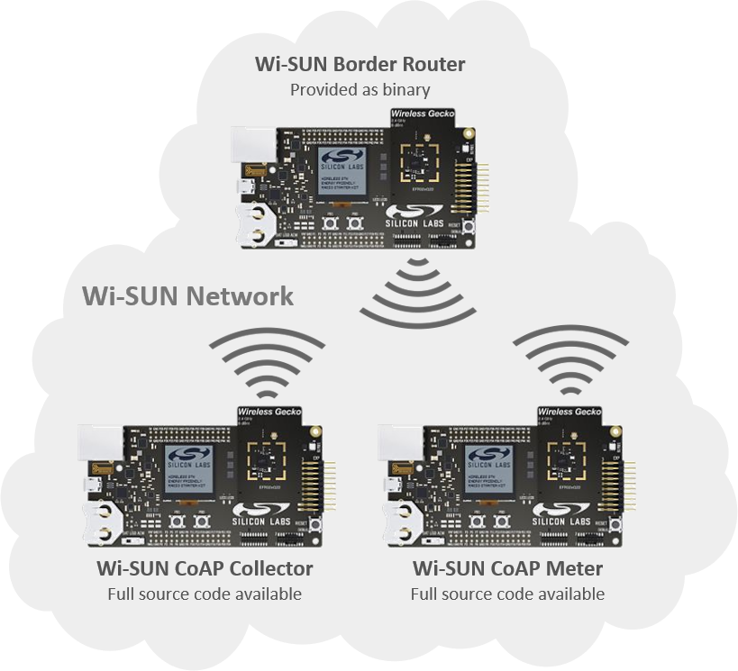

# Wi-SUN - SoC CoAP Meter

## Table of Contents

- [Introduction](#introduction)
- [Getting Started](#getting-started)
- [Send Sensor Data to a CoAP Collector](#send-sensor-data-to-a-coap-collector)
- [Get Sensor Data Using libCoAP Client over a Backhaul Connection](#get-sensor-data-using-libcoap-client-over-a-backhaul-connection)
- [EFR32FG23 Support](#efr32fg23-support)
- [Troubleshooting](#troubleshooting)
- [Resources](#resources)
- [Report Bugs & Get Support](#report-bugs--get-support)

## Introduction

The Wi-SUN CoAP Meter sample application demonstrates the use of the Constrained Application Protocol (CoAP) protocol to emulate a metering-like application. The CoAP Meter sends sensor measurements to a CoAP Collector device in the same Wi-SUN network. It also shows an implementation example of an application layer library on top of the Wi-SUN stack (i.e., CoAP).

## Getting Started

To get started with Wi-SUN and Simplicity Studio, see [Getting Started with Wi-SUN Application Development](https://docs.silabs.com/wisun/latest/wisun-getting-started-development).

The Wi-SUN CoAP Meter sample application exposes a command-line interface to interact with the Wi-SUN stack. The goal of this procedure is to create the Wi-SUN network described in the following figure and have the CoAP Collector monitor the CoAP Meter.

To get started with the example, follow the steps below:

- Flash the "Wi-SUN Border Router" demonstration to a device and start the Border Router.
- Create and build the CoAP Meter project.
- Flash the CoAP Meter project to a second device.
- Create and build the CoAP Collector project.
- Flash the CoAP Collector project to a third device.
- Using Simplicity Studio, open consoles on both the Meter and Collector devices.
- Wait for the CoAP Collector and Meter to join the Wi-SUN Border Router network.

See the associated sections in [Wi-SUN SDK Quick Start Guide](https://docs.silabs.com/wisun/latest/wisun-getting-started-overview) for step-by-step guidelines for each operation.

## Send Sensor Data to a CoAP Collector

The three Wi-SUN devices (Border Router, Meter, Collector) are now part of the same Wi-SUN network. See the *Wi-SUN - SoC Collector* readme to configure the Collector.

The connection between a CoAP Meter and the CoAP Collector starts with a registration request from the CoAP Collector.

    {
      "token_len": 0,
      "coap_status": 0,
      "msg_code": 1,
      "msg_type": 0,
      "content_format": 0,
      "msg_id": 7,
      "payload_len": 4,
      "uri_path_len": 10,
      "token": "n/a",
      "uri_path": "sensor/all",
      "payload": "register"}
    [Registration request from fd2a:6e01:9bfc:990c:20d:6fff:fe20:bd45]
    [Building response message (88 bytes)]

After receiving a registration request, the CoAP Meter device sends groups of measurement data to the CoAP Collector periodically.
When the CoAP Meter sends sensor data to the CoAP Collector, a message is output in the console, as follows.

    [Building response message (208 bytes)]
    [fd2a:6e01:9bfc:990c:20d:6fff:fe20:bd45: Measurement packet has been sent (208 bytes)]

The time between the cycles can be configured in FFN mode. In LFN device mode, the schedule time is different based on the selected LFN profile. Measurement and sending schedule can be further customized with callback functions.

The CoAP Collector can stop monitoring a CoAP Meter with a remove request.

    {
      "token_len": 0,
      "coap_status": 0,
      "msg_code": 1,
      "msg_type": 0,
      "content_format": 0,
      "msg_id": 7,
      "payload_len": 4,
      "uri_path_len": 10,
      "token": "n/a",
      "uri_path": "sensor/all",
      "payload": "remove"}
    [Remove request from fd2a:6e01:9bfc:990c:20d:6fff:fe20:bd45]
    [Collector has been removed: fd2a:6e01:9bfc:990c:20d:6fff:fe20:bd45]

CoAP Meter devices can respond to async requests.

    {
      "token_len": 0,
      "coap_status": 0,
      "msg_code": 1,
      "msg_type": 0,
      "content_format": 0,
      "msg_id": 7,
      "payload_len": 4,
      "uri_path_len": 10,
      "token": "n/a",
      "uri_path": "sensor/all",
      "payload": "async"}
    [Async request from fd2a:6e01:9bfc:990c:20d:6fff:fe20:bd45]
    [Building response message (88 bytes)]

CoAP Meter application includes sensor/all (mentioned above), sensor/temperature, sensor/humidity, sensor/light and gpio/led, as additional registered resources.
Resource Handler service is not enabled by default in order to reduce power consumption. Enabling Resource Handler service disables the power optimized functionality. If Resource Handler service is enabled, information about resources is available using any third-party CoAP client application, like libCoAP-client.

## Get Sensor Data Using libCoAP Client over a Backhaul Connection

Any CoAP client that has IPv6 connectivity with the Wi-SUN CoAP Meter can retrieve the sensor metering data.

Using libCoAP, you can also toggle the board LEDs and discover the attributes hosted by a CoAP server.
See [Network Configuration Introduction](https://docs.silabs.com/wisun/latest/wisun-network-configuration) for more information.

## EFR32FG23 Support

This sample application provides limited functionality for the EFR32FG23 platform. It is designed to operate as a Limited Function Node (LFN) only. To ensure minimal memory footprint, the application has been optimized for size.

The following features are disabled compared to other supported platforms:

- [CoAP Notification service](https://docs.silabs.com/wisun/latest/wisun-stack-api/sl-wisun-coap-api)
- [Command Line Interface (CLI)](https://docs.silabs.com/gecko-platform/latest/platform-service-cli-overview/)
- [Ping functionality](https://docs.silabs.com/wisun/latest/wisun-stack-api/sl-wisun-ping-api)
- [Wi-SUN Application Settings](https://docs.silabs.com/wisun/latest/wisun-stack-api/sl-wisun-app-setting)
- [Application custom callback functions](https://docs.silabs.com/wisun/latest/wisun-custom-application/02-custom-callback-join-state)
- [RTT buffer sizes are decreased](https://docs.silabs.com/wisun/latest/wisun-stack-api/sl-wisun-trace-api)

## Troubleshooting

Before programming the radio board mounted on the WSTK, ensure the power supply switch is in the AEM position (right side), as shown.

## Resources

- [Wi-SUN Stack API documentation](https://docs.silabs.com/wisun/latest)

## Report Bugs & Get Support

You are always encouraged and welcome to ask any questions or report any issues you found to us via [Silicon Labs Community](https://community.silabs.com/s/topic/0TO1M000000qHc6WAE/wisun).
