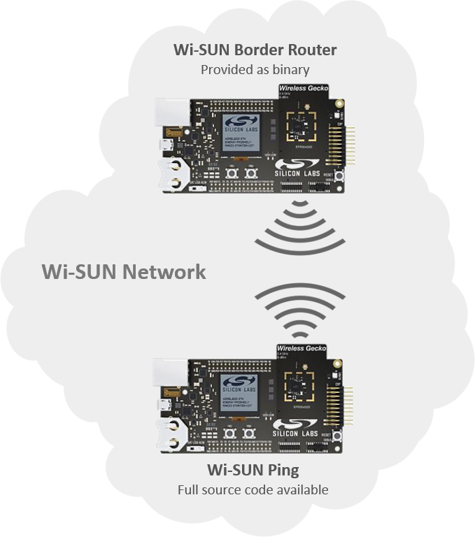

# Wi-SUN - SoC Ping

## Table of Contents

- [Introduction](#introduction)
- [Getting Started](#getting-started)
- [Ping the Border Router](#ping-the-border-router)
- [Troubleshooting](#troubleshooting)
- [Resources](#resources)
- [Report Bugs & Get Support](#report-bugs--get-support)

## Introduction

The Wi-SUN Ping sample application demonstrates how to use the Wi-SUN application framework and the POSIX-like socket API to implement a basic ping application.

## Getting Started

To get started with Wi-SUN and Simplicity Studio, see [Getting Started with Wi-SUN Application Development](https://docs.silabs.com/wisun/latest/wisun-getting-started-development).

The Wi-SUN Ping sample application exposes a command-line interface to interact with the Wi-SUN stack and trigger ping packets. The goal of this procedure is to create the Wi-SUN network described in the following figure and have the Wi-SUN Ping device ping the Wi-SUN Border Router.

To get started with the example, follow the steps below:

- Flash the "Wi-SUN Border Router" demonstration in a first device and start the Border Router.
- Create and build the Wi-SUN Ping project.
- Flash the Wi-SUN Ping project a second device.
- Using Simplicity Studio, open a console on the Wi-SUN Ping device.
- Wait for the Wi-SUN Ping device to join the Wi-SUN Border Router network.

Refer to the associated sections in [Wi-SUN SDK Quick Start Guide](https://docs.silabs.com/wisun/latest/wisun-getting-started-overview) if you want step-by-step guidelines to go through each operation.

## Ping the Border Router

The two Wi-SUN devices (Border Router and Wi-SUN Ping) are now part of the same Wi-SUN network. To check the commands exposed in the Wi-SUN Ping application, enter:

    wisun help

To retrieve the Border Router IPv6 address, enter:

    wisun get wisun.ip_address_border_router

The Wi-SUN Ping application has a specific command: `wisun ping [IPv6 address]`. Use the command to ping the Border Router.

    wisun ping [Border Router Global IPv6 address]

If the ping command is successful, the pong message size and latency are output on the console.

    > w p fd00:6172:6d00:0:20d:6fff:fe20:bd95
    PING fd00:6172:6d00:0:20d:6fff:fe20:bd95: 40 data bytes
    > [40 bytes from fd00:6172:6d00:0:20d:6fff:fe20:bd95: icmp_seq=1 time=196.231 ms]

In this case, the ping took 196 milliseconds to come back to the Wi-SUN device. The ping command can be used to communicate with other Wi-SUN devices in the same Wi-SUN network.

## Troubleshooting

Before programming the radio board mounted on the WSTK, ensure the power supply switch is in the AEM position (right side), as shown.

## Resources

- [Wi-SUN Stack API documentation](https://docs.silabs.com/wisun/latest)

## Report Bugs & Get Support

You are always encouraged and welcome to ask any questions or report any issues you found to us via [Silicon Labs Community](https://community.silabs.com/s/topic/0TO1M000000qHc6WAE/wisun).
